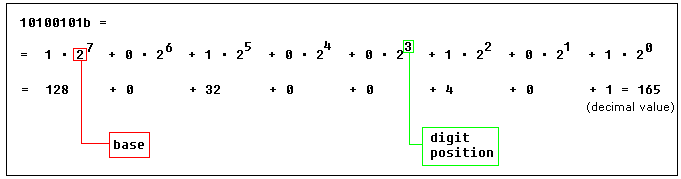
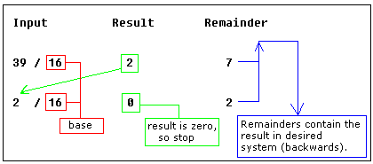

# Numbering Systems

### **Decimal System**

Most people today use decimal representation to count. In the decimal system there are 10 digits:

**0, 1, 2, 3, 4, 5, 6, 7, 8, 9**

These digits can represent any value, for example:
**754**.
The value is formed by the sum of each digit, multiplied by the **base** (in this case it is **10** because there are 10 digits in decimal system) in power of digit position (counting from zero):

Position of each digit is very important! for example if you place "7" to the end:
**547**
it will be another value:

**Important note:** any number in power of zero is 1, even zero in power of zero is 1:

### **Binary System**

Computers are not as smart as humans are (or not yet), it's easy to make an electronic machine with two states: **on** and **off**, or **1** and **0**.
Computers use binary system, binary system uses 2 digits:

**0, 1**

And thus the **base** is **2**.

Each digit in a binary number is called a **BIT**, 4 bits form a **NIBBLE**, 8 bits form a **BYTE**, two bytes form a **WORD**, two words form a **DOUBLE WORD** (rarely used):

There is a convention to add **"b"** in the end of a binary number, this way we can determine that 101b is a binary number with decimal value of 5.

The binary number **10100101b** equals to decimal value of 165:

### **Hexadecimal System**

Hexadecimal System uses 16 digits:

**0, 1, 2, 3, 4, 5, 6, 7, 8, 9, A, B, C, D, E, F**

And thus the **base** is **16**.

Hexadecimal numbers are compact and easy to read.
It is very easy to convert numbers from binary system to hexadecimal system and vice-versa, every nibble (4 bits) can be converted to a hexadecimal digit using this table:

 

There is a convention to add **"h"** in the end of a hexadecimal number, this way we can determine that 5Fh is a hexadecimal number with decimal value of 95.
We also add **"0"** (zero) in the beginning of hexadecimal numbers that begin with a letter (A..F), for example **0E120h**.

The hexadecimal number **1234h** is equal to decimal value of 4660:

### **Converting from Decimal System to Any Other**

In order to convert from decimal system, to any other system, it is required to divide the decimal value by the **base** of the desired system, each time you should remember the **result** and keep the **remainder**, the divide process continues until the **result** is zero.

The **remainders** are then used to represent a value in that system.

Let's convert the value of **39** (base 10) to *Hexadecimal System* (base 16):

As you see we got this hexadecimal number: **27h**.
All remainders were below **10** in the above example, so we do not use any letters.

Here is another more complex example:
let's convert decimal number **43868** to hexadecimal form:

The result is **0AB5Ch**, we are using [the above table](https://jbwyatt.com/253/emu/numbering_systems_tutorial.html#hextable) to convert remainders over **9** to corresponding letters.

Using the same principle we can convert to binary form (using **2** as the divider), or convert to hexadecimal number, and then convert it to binary number using [the above table](https://jbwyatt.com/253/emu/numbering_systems_tutorial.html#hextable):

As you see we got this binary number: **1010101101011100b**

### **Signed Numbers**

There is no way to say for sure whether the hexadecimal byte **0FFh** is positive or negative, it can represent both decimal value "**255**" and "**- 1**".

8 bits can be used to create **256** combinations (including zero), so we simply presume that first **128** combinations (**0..127**) will represent positive numbers and next **128** combinations (**128..256**) will represent negative numbers.

In order to get "**- 5**", we should subtract **5** from the number of combinations (**256**), so it we'll get: **256 - 5 = 251**.

Using this complex way to represent negative numbers has some meaning, in math when you add "**- 5**" to "**5**" you should get zero.
This is what happens when processor adds two bytes **5** and **251**, the result gets over **255**, because of the overflow processor gets zero!

When combinations **128..256** are used the high bit is always **1**, so this maybe used to determine the sign of a number.

The same principle is used for **words** (16 bit values), 16 bits create **65536** combinations, first 32768 combinations (**0..32767**) are used to represent positive numbers, and next 32768 combinations (**32767..65535**) represent negative numbers.