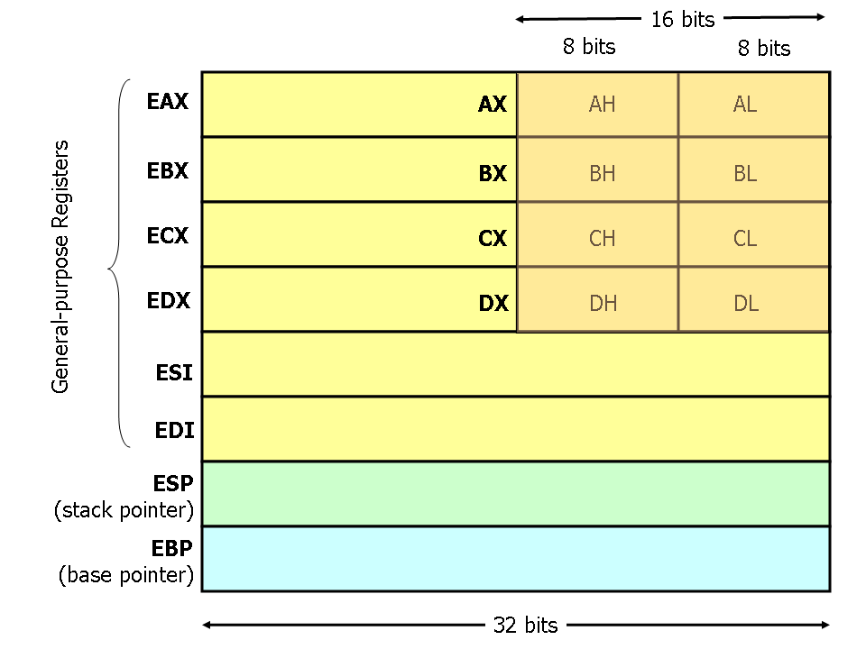

## CALM DOWN: IT’S JUST ASSEMBLY !

The x86 instruction set architecture is at the heart of CPUs that power computers and remote servers. Being able to read and write code in low-level assembly language is a powerful skill to have. It enables you to write faster code, use machine features unavailable in C, and reverse-engineer compiled code.

Assembly language is one of the closest forms of communication that humans can engage in with a computer. With assembly, the programmer can precisely track the flow of data and execution in a program in a mostly human-readable form.

This guide describes the basics of 32-bit x86 assembly language programming, covering a small but useful subset of the available instructions and assembler directives. There are several different assembly languages for generating x86 machine code. The one we will use is the Microsoft Macro Assembler (MASM) assembler. MASM uses the standard Intel syntax for writing x86 assembly code.

The prerequisites to reading this article are working with binary numbers, moderate experience programming in an imperative language (C/C++/Java/Python/etc.), and the concept of memory pointers (C/C++). You do not need to know how CPUs work internally or have prior exposure to assembly language.

>  Is it the Same On Windows/DOS/Linux?

The answers to this question are yes and no. The basic x86 machine code is dependent only on the processor. The x86 versions of Windows and Linux are obviously built on the x86 machine code. There are a few differences between Linux and Windows programming in x86 Assembly:

1. On a Linux computer, the most popular assemblers are the GAS assembler, which uses the AT&T syntax for writing code, and the Netwide Assembler, also known as NASM, which uses a syntax similar to MASM.
2. On a Windows computer, the most popular assembler is MASM, which uses the Intel syntax but also, a lot of Windows users use NASM.
3. The available software interrupts, and their functions, are different on Windows and Linux.
4. The available code libraries are different on Windows and Linux.

Using the same assembler, the basic assembly code written on each Operating System is basically the same, except you interact with Windows differently than you interact with Linux.

> Registers



An x86 CPU has eight 32-bit general-purpose registers. For historical reasons, the registers are named {`eax`, `ecx`, `edx`, `ebx`, `esp`, `ebp`, `esi`, `edi`}.

Each register can hold any 32-bit integer value. The x86 architecture actually has over a hundred registers, but we will only cover specific ones when needed.


There are actually eight 16-bit and eight 8-bit registers that are subparts of the eight 32-bit general-purpose registers. These features come from the 16-bit era of x86 CPUs, but still have some occasional use in 32-bit mode. The 16-bit registers are named {`ax`, `cx`, `dx`, `bx`, `sp`, `bp`, `si`, `di`} and represent the bottom 16 bits of the corresponding 32-bit registers {`eax`, `ecx`, ..., `edi`} (the prefix “e” stands for “extended”). The 8-bit registers are named {`al`, `cl`, `dl`, `bl`, `ah`, `ch`, `dh`, `bh`} and represent the low and high 8 bits of the registers {`ax`, `cx`, `dx`, `bx`}. Whenever the value of a 16-bit or 8-bit register is modified, the upper bits belonging to the full 32-bit register will remain unchanged.

#### **General-Purpose Registers (GPR) - 16-bit naming conventions**

The 8 GPRs are as follows:

1. Accumulator register (AX). Used in arithmetic operations
2. Counter register (CX). Used in shift/rotate instructions and loops.
3. Data register (DX). Used in arithmetic operations and I/O operations.
4. Base register (BX). Used as a pointer to data (located in segment register DS, when in segmented mode).
5. Stack Pointer register (SP). Pointer to the top of the stack.
6. Stack Base Pointer register (BP). Used to point to the base of the stack.
7. Source Index register (SI). Used as a pointer to a source in stream operations.
8. Destination Index register (DI). Used as a pointer to a destination in stream operations.

> General-purpose registers (64-bit naming conventions)

64-bit x86 adds 8 more general-purpose registers, named R8, R9, R10 and so on up to R15.

- R8–R15 are the new 64-bit registers.
- R8D–R15D are the lowermost 32 bits of each register.
- R8W–R15W are the lowermost 16 bits of each register.
- R8B–R15B are the lowermost 8 bits of each register.

> Segment Registers


The 6 Segment Registers are:

- Stack Segment (SS). Pointer to the stack ('S' stands for 'Stack').
- Code Segment (CS). Pointer to the code ('C' stands for 'Code').
- Data Segment (DS). Pointer to the data ('D' comes after 'C').
- Extra Segment (ES). Pointer to extra data ('E' stands for 'Extra').
- F Segment (FS). Pointer to more extra data ('F' comes after 'E').
- G Segment (GS). Pointer to still more extra data ('G' comes after 'F').

> EFLAGS Register


There is a 32-bit register named `eflags` which is *implicitly* read or written in many instructions. In other words, its value plays a role in the instruction execution, but the register is not mentioned in the assembly code.

Arithmetic instructions such as `addl` usually update `eflags` based on the computed result. The instruction would set or clear flags like carry (CF), overflow (OF), sign (SF), parity (PF), zero (ZF), etc.

**The different use of these flags are:**

| Bit Number | Flag                                                         |
| :--------: | :----------------------------------------------------------- |
|     0.     | **CF** : Carry Flag. Set if the last arithmetic operation carried (addition) or borrowed (subtraction) a bit beyond the size of the register. This is then checked when the operation is followed with an add-with-carry or subtract-with-borrow to deal with values too large for just one register to contain. |
|     2.     | **PF** : Parity Flag. Set if the number of set bits in the least significant byte is a multiple of 2. |
|     4.     | **AF** : Adjust Flag. Carry of Binary Code Decimal (BCD) numbers arithmetic operations. |
|     6.     | **ZF** : Zero Flag. Set if the result of an operation is Zero (0). |
|     7.     | **SF** : Sign Flag. Set if the result of an operation is negative. |
|     8.     | **TF** : Trap Flag. Set if step by step debugging.           |
|     9.     | **IF** : Interruption Flag. Set if interrupts are enabled.   |
|    10.     | **DF** : Direction Flag. Stream direction. If set, string operations will decrement their pointer rather than incrementing it, reading memory backwards. |
|    11.     | **OF** : Overflow Flag. Set if signed arithmetic operations result in a value too large for the register to contain. |
|   12-13.   | **IOPL** : I/O Privilege Level field (2 bits). I/O Privilege Level of the current process. |
|    14.     | **NT** : Nested Task flag. Controls chaining of interrupts. Set if the current process is linked to the next process. |
|    16.     | **RF** : Resume Flag. Response to debug exceptions.          |
|    17.     | **VM** : Virtual-8086 Mode. Set if in 8086 compatibility mode. |
|    18.     | **AC** : Alignment Check. Set if alignment checking of memory references is done. |
|    19.     | **VIF** : Virtual Interrupt Flag. Virtual image of IF.       |
|    20.     | **VIP** : Virtual Interrupt Pending flag. Set if an interrupt is pending. |
|    21.     | **ID** : Identification Flag. Support for CPUID instruction if can be set. |

> Instruction Pointer

The `EIP `register contains the address of the **next** instruction to be executed if no branching is done.

EIP can only be read through the stack after a `call` instruction.

>  Memory

The x86 architecture is little-endian, meaning that multi-byte values are written least significant byte first. (This refers only to the ordering of the bytes, not to the bits.)


### Addressing modes

Modern x86-compatible processors are capable of addressing up to 232 bytes of memory: memory addresses are 32-bits wide.

The addressing mode indicates the manner in which the operand is presented.

Here we illustrate some examples using the mov instruction that moves data between registers and memory. This instruction has two operands: the first is the destination and the second specifies the source.

- Register Addressing

    (operand address R is in the address field)

```assembly
mov ax, bx  ; moves contents of register bx into ax
```

- Immediate

    (actual value is in the field)

```assembly
mov ax, 1   ; moves value of 1 into register ax
```

or

```assembly
mov ax, 010Ch ; moves value of 0x010C into register ax
```

- Direct memory addressing

    (operand address is in the address field)

```assembly
.data
my_var dw 0abcdh ; my_var = 0xabcd
.code
mov ax, [my_var] ; copy my_var content into ax (ax=0xabcd)
```

- Direct offset addressing

    (uses arithmetics to modify address)

```assembly
byte_table db 12, 15, 16, 22 ; table of bytes
mov al, [byte_table + 2]
mov al, byte_table[2] ; same as previous instruction
```

- Register Indirect

    (field points to a register that contains the operand address)

```assembly
mov ax, [di]
```

### Stack


The stack is a Last In First Out (LIFO) data structure; data is pushed onto it and popped off of it in the reverse order.

```assembly
mov ax, 006Ah
mov bx, F79Ah
mov cx, 1124h

push ax ; push the value in AX onto the top of the stack, which now holds the value 0x006A.
push bx ; do the same thing to the value in BX; the stack now has 0x006A and 0xF79A.
push cx ; now the stack has 0x006A, 0xF79A, and 0x1124.

call do_stuff ; do some stuff. The function is not forced to save the registers it uses, hence us saving them.

pop cx ; pop the element on top of the stack, 0x1124, into CX; the stack now has 0x006A and 0xF79A.
pop bx ; pop the element on top of the stack, 0xF79A, into BX; the stack now has just 0x006A.
pop ax ; pop the element on top of the stack, 0x006A, into AX; the stack is now empty.
```

The Stack is usually used to pass arguments to functions or procedures and also to keep track of control flow when the `call` instruction is used. The other common use of the Stack is temporarily saving registers.

> Comments

When writing code, it is very helpful to use some comments explaining what is going on,A comment is a piece of regular text that the assembler just discards when turning assembly code into machine code. In assembly, comments are usually denoted by a semicolon `;`, although **GAS** uses `#` for single line comments and `/* … */` for block comments possibly spanning multiple lines.

Everything after the semicolon, on the same line, is ignored.

# X86 Instructions

There are instructions that take no operands and others take 2 and others take 3 operands.
also there is a difference between Intel and GAS syntax

```assembly
Instr src, dest	      ;>>> GAS
Instr dest, src       ;>>> Intel	
```

### Suffixes

Some instructions, especially when built for non-Windows platforms (i.e. Unix, Linux, etc.), require the use of suffixes to specify the size of the data which will be the subject of the operation. Some possible suffixes are:

- `b` (byte) = 8 bits.
- `w` (word) = 16 bits.
- `l` (long) = 32 bits.
- `q` (quad) = 64 bits.

> Size Directives

The size directives BYTE PTR, WORD PTR, and DWORD PTR serve this purpose, indicating sizes of 1, 2, and 4 bytes respectively.

```assembly
mov BYTE PTR [ebx], 2	; Move 2 into the single byte at the address stored in EBX.
mov WORD PTR [ebx], 2	; Move the 16-bit integer representation of 2 into the 2 bytes starting at the address in EBX.
mov DWORD PTR [ebx], 2    	; Move the 32-bit integer representation of 2 into the 4 bytes starting at the address in EBX.
```

### Declaring Data

we can declare static data regions (analogous to global variables) in x86 assembly using special assembler directives for this purpose. Data declarations should be preceded by the `.DATA` directive. Following this directive, the directives `DB`, `DW`, and `DD `can be used to declare one, two, and four byte data locations, respectively. Declared locations can be labeled with names for later reference — this is similar to declaring variables by name, but abides by some lower level rules. For example, locations declared in sequence will be located in memory next to one another.

```assembly
.DATA			
var  DB 64  	; Declare a byte, referred to as location var, containing the value 64.
var2 DB ?	; Declare an uninitialized byte, referred to as location var2.
     DB 10	; Declare a byte with no label, containing the value 10. Its location is var2 + 1.
X	 DW ?	; Declare a 2-byte uninitialized value, referred to as location X.
Y	 DD 30000    	; Declare a 4-byte value, referred to as location Y, initialized to 30000.
```

Unlike in high level languages where arrays can have many dimensions and are accessed by indices, arrays in x86 assembly language are simply a number of cells located contiguously in memory. An array can be declared by just listing the values, as in the example above. Two other common methods used for declaring arrays of data are the `DUP `directive and the use of string literals. The `DUP `directive tells the assembler to duplicate an expression a given number of times. For example, `4 DUP(2) `is equivalent to 2, 2, 2, 2.

```assembly
Z	  DD 1, 2, 3	; Declare three 4-byte values, initialized to 1, 2, and 3. The value of location Z + 8 will be 3.
bytes  DB 10 DUP(?)	; Declare 10 uninitialized bytes starting at location bytes.
arr	   DD 100 DUP(0)    	; Declare 100 4-byte words starting at location arr, all initialized to 0
str	   DB 'hello',0	; Declare 6 bytes starting at the address str, initialized to the ASCII character values for hello and the null (0) byte.
```

------

Machine instructions generally fall into three categories: data movement, arithmetic/logic, and control-flow.

This section should not be considered an exhaustive list of x86 instructions, but rather a useful subset. For a complete list, see [Intel's instruction set reference](http://www.intel.com/content/www/us/en/processors/architectures-software-developer-manuals.html).

We use the following notation:
```assembly
<reg32>    	Any 32-bit register (EAX, EBX, ECX, EDX, ESI, EDI, ESP, or EBP)
<reg16>	Any 16-bit register (AX, BX, CX, or DX)
<reg8>	Any 8-bit register (AH, BH, CH, DH, AL, BL, CL, or DL)
<reg>	Any register
<mem>	A memory address (e.g., [eax], [var + 4], or dword ptr [eax+ebx])
<con32>	Any 32-bit constant
<con16>	Any 16-bit constant
<con8>	Any 8-bit constant
<con>	Any 8-, 16-, or 32-bit constant
```

### Data Movement Instructions

**`mov`** — Move (Opcodes: 88, 89, 8A, 8B, 8C, 8E, ...)

> The mov instruction copies the data item referred to by its second operand (i.e. register contents, memory contents, or a constant value) into the location referred to by its first operand (i.e. a register or memory). While register-to-register moves are possible, **direct memory-to-memory moves are not.** In cases where memory transfers are desired, the source memory contents must first be loaded into a register, then can be stored to the destination memory address.

```assembly
mov <reg>,<reg>
mov <reg>,<mem>
mov <mem>,<reg>
mov <reg>,<const>
mov <mem>,<const>

mov eax, ebx — copy the value in ebx into eax
mov byte ptr [var], 5 — store the value 5 into the byte at location var
```

**`push`** — Push stack (Opcodes: FF, 89, 8A, 8B, 8C, 8E, ...)

> The push instruction places its operand onto the top of the hardware supported stack in memory. Specifically, push first decrements **ESP** by 4, then places its operand into the contents of the 32-bit location at address [ESP]. ESP (the stack pointer) is decremented by push since the x86 stack grows down - i.e. the stack grows from high addresses to lower addresses.

```assembly
push <reg32>
push <mem>
push <con32>

push eax — push eax on the stack
push [var] — push the 4 bytes at address var onto the stack
```

**`pop`** — Pop stack

> The pop instruction removes the 4-byte data element from the top of the hardware-supported stack into the specified operand (i.e. register or memory location). It first moves the 4 bytes located at memory location [SP] into the specified register or memory location, and then increments SP by 4.

```assembly
pop <reg32>
pop <mem>

pop edi — pop the top element of the stack into EDI.
pop [ebx] — pop the top element of the stack into memory at the four bytes starting at location EBX.
```

**`lea`** — Load effective address

> The lea instruction places the *address* specified by its second operand into the register specified by its first operand. Note, the *contents* of the memory location are not loaded, only the effective address is computed and placed into the register. This is useful for obtaining a pointer into a memory region.

```assembly
lea <reg32>,<mem>

lea edi, [ebx+4*esi] — the quantity EBX+4*ESI is placed in EDI.
lea eax, [var] — the value in var is placed in EAX.
lea eax, [val] — the value val is placed in EAX.
```

### Arithmetic and Logic Instructions

**`add`** — Integer Addition

> The add instruction adds together its two operands, storing the result in its first operand. Note, whereas both operands may be registers, at most one operand may be a memory location.

```assembly
add <reg>,<reg>
add <reg>,<mem>
add <mem>,<reg>
add <reg>,<con>
add <mem>,<con>

add eax, 10 — EAX ← EAX + 10
add BYTE PTR [var], 10 — add 10 to the single byte stored at memory address var
```

**`sub`** — Integer Subtraction

> The sub instruction stores in the value of its first operand the result of subtracting the value of its second operand from the value of its first operand. As with add

```assembly
sub <reg>,<reg>
sub <reg>,<mem>
sub <mem>,<reg>
sub <reg>,<con>
sub <mem>,<con>

sub al, ah — AL ← AL - AH
sub eax, 216 — subtract 216 from the value stored in EAX
```

**`inc`, `dec`** — Increment, Decrement

> The inc instruction increments the contents of its operand by one. The dec instruction decrements the contents of its operand by one.

```assembly
inc <reg>
inc <mem>
dec <reg>
dec <mem>

dec eax — subtract one from the contents of EAX.
inc DWORD PTR [var] — add one to the 32-bit integer stored at location var
```

**`imul`** — Integer Multiplication

> The imul instruction has two basic formats: two-operand (first two syntax listings below) and three-operand (last two syntax listings below)
>
> The two-operand form multiplies its two operands together and stores the result in the first operand. The result (i.e. first) operand must be a register.
>
> The three operand form multiplies its second and third operands together and stores the result in its first operand. Again, the result operand must be a register. Furthermore, the third operand is restricted to being a constant value.

```assembly
imul <reg32>,<reg32>
imul <reg32>,<mem>
imul <reg32>,<reg32>,<con>
imul <reg32>,<mem>,<con>

imul eax, [var] — multiply the contents of EAX by the 32-bit contents of the memory location var. Store the result in EAX.
imul esi, edi, 25 — ESI → EDI * 25
```

**`idiv`** — Integer Division

> The idiv instruction divides the contents of the 64 bit integer EDX:EAX (constructed by viewing EDX as the most significant four bytes and EAX as the least significant four bytes) by the specified operand value. The quotient result of the division is stored into EAX, while the remainder is placed in EDX.

```assembly
idiv <reg32>
idiv <mem>

idiv ebx — divide the contents of EDX:EAX by the contents of EBX. Place the quotient in EAX and the remainder in EDX.
idiv DWORD PTR [var] — divide the contents of EDX:EAX by the 32-bit value stored at memory location var. Place the quotient in EAX and the remainder in EDX.
```

**`and`, `or`, `xor`** — Bitwise logical and, or and exclusive or

> These instructions perform the specified logical operation (logical bitwise and, or, and exclusive or, respectively) on their operands, placing the result in the first operand location.

```assembly
and <reg>,<reg>
and <reg>,<mem>
and <mem>,<reg>
and <reg>,<con>
and <mem>,<con>

or <reg>,<reg>
or <reg>,<mem>
or <mem>,<reg>
or <reg>,<con>
or <mem>,<con>

xor <reg>,<reg>
xor <reg>,<mem>
xor <mem>,<reg>
xor <reg>,<con>
xor <mem>,<con>

and eax, 0fH — clear all but the last 4 bits of EAX.
xor edx, edx — set the contents of EDX to zero.
```

**`not`** — Bitwise Logical Not

> Logically negates the operand contents (that is, flips all bit values in the operand).

```assembly
not <reg>
not <mem>

not BYTE PTR [var] — negate all bits in the byte at the memory location var.
```

**`neg`** — Negate

> Performs the two's complement negation of the operand contents.

```assembly
neg <reg>
neg <mem>

neg eax — EAX → - EAX
```

**`shl`, `shr`** — Shift Left, Shift Right

> These instructions shift the bits in their first operand's contents left and right, padding the resulting empty bit positions with zeros. The shifted operand can be shifted up to 31 places. The number of bits to shift is specified by the second operand, which can be either an 8-bit constant or the register CL. In either case, shifts counts of greater then 31 are performed modulo 32.

```assembly
shl <reg>,<con8>
shl <mem>,<con8>
shl <reg>,<cl>
shl <mem>,<cl>

shr <reg>,<con8>
shr <mem>,<con8>
shr <reg>,<cl>
shr <mem>,<cl>

shl eax, 1 — Multiply the value of EAX by 2 (if the most significant bit is 0)
shr ebx, cl — Store in EBX the floor of result of dividing the value of EBX by 2n wheren is the value in CL.
```

### Control Flow Instructions