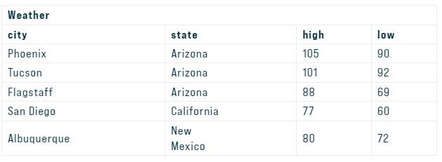
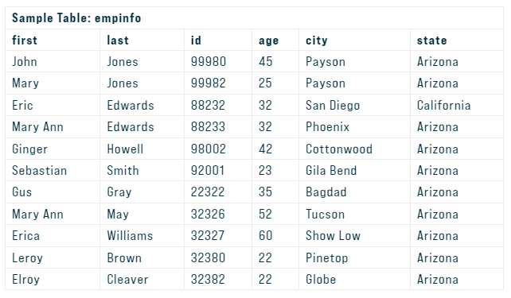

#### **Introduction to SQL**

SQL (pronounced “ess-que-el”) stands for Structured Query Language. SQL is used to communicate with a database. It is the standard language for relational database management systems. SQL statements are used to perform tasks such as update data on a database, or retrieve data from a database. Some common relational database management systems that use SQL are: Oracle, Sybase, Microsoft SQL Server, Access, Ingres, etc.

##### TABLE BASICS

A relational database system contains one or more objects called tables. The data or information for the database are stored in these tables. Tables are uniquely identified by their names and are comprised of columns and rows. Columns contain the column name, data type, and any other attributes for the column. Rows contain the records or data for the columns. Here is a sample table called “weather”.



#### SELECTING DATA

The **select** statement is used to query the database and retrieve selected data that match the criteria that you specify. Here is the format of a simple select statement:

```sql
select "column1"
  [,"column2",etc] 
  from "tablename"
  [where "condition"];
  [] = optional
```

The column names that follow the select keyword determine which columns will be returned in the results. You can select as many column names that you’d like, or you can use a `*` to select all columns.

The table name that follows the keyword **from** specifies the table that will be queried to retrieve the desired results.

The **where** clause (optional) specifies which data values or rows will be returned or displayed, based on the criteria described after the keyword **where**.

Conditional selections used in the **where** clause:

| =    | Equal                 |
| ---- | --------------------- |
| >    | Greater than          |
| <    | Less than             |
| >=   | Greater than or equal |
| <=   | Less than or equal    |
| <>   | Not equal to          |
| LIKE | *See note below       |

The **LIKE** pattern matching operator can also be used in the conditional selection of the where clause. Like is a very powerful operator that allows you to select only rows that are “like” what you specify. The percent sign `%` can be used as a wild card to match any possible character that might appear before or after the characters specified. For example:

```sql
select first, last, city
   from empinfo
   where first LIKE 'Er%';
```

This SQL statement will match any first names that start with ‘Er’. **Strings must be in single quotes.**

Or you can specify,

```sql
select first, last
   from empinfo
   where last LIKE '%s';
```

This statement will match any last names that end in a ‘s’.

```sql
select * from empinfo
   where first = 'Eric';
```

This will only select rows where the first name equals ‘Eric’ exactly.



#### CREATING TABLES

The **create table** statement is used to create a new table. Here is the format of a simple **create table** statement:

```sql
create table "tablename"
("column1" "data type",
 "column2" "data type",
 "column3" "data type");
```

Format of create table if you were to use optional constraints:

```sql
create table "tablename"
("column1" "data type" 
         [constraint],
 "column2" "data type" 
         [constraint],
 "column3" "data type" 
        [constraint]);
 [ ] = optional
```

**Note:** You may have as many columns as you’d like, and the constraints are optional.

**Example:**

```sql
create table employee
(first varchar(15),
 last varchar(20),
 age number(3),
 address varchar(30),
 city varchar(20),
 state varchar(20));
```

All SQL statements should end with a `;`.

The table and column names must start with a letter and can be followed by letters, numbers, or underscores – not to exceed a total of 30 characters in length. Do not use any SQL reserved keywords as names for tables or column names (such as “select”, “create”, “insert”, etc).

Data types specify what the type of data can be for that particular column. If a column called “Last_Name”, is to be used to hold names, then that particular column should have a “varchar” (variable-length character) data type.

Here are the most common Data types:

| `char(size)`     | Fixed-length character string. Size is specified in parenthesis. Max 255 bytes. |
| ---------------- | ------------------------------------------------------------ |
| `varchar(size)`  | Variable-length character string. Max size is specified in parenthesis. |
| `number(size)`   | Number value with a max number of column digits specified in parenthesis. |
| `date`           | Date value                                                   |
| `number(size,d)` | Number value with a maximum number of digits of “size” total, with a maximum number of “d” digits to the right of the decimal. |

**What are constraints?** When tables are created, it is common for one or more columns to have **constraints** associated with them. A constraint is basically a rule associated with a column that the data entered into that column must follow. For example, a `“unique”` constraint specifies that no two records can have the same value in a particular column. They must all be unique. The other two most popular constraints are `“not null”` which specifies that a column can’t be left blank, and `“primary key”`. A `“primary key”` constraint defines a unique identification of each record (or row) in a table.

#### INSERTING INTO A TABLE

The **insert** statement is used to insert or add a row of data into the table.

To insert records into a table, enter the key words **insert into** followed by the table name, followed by an open parenthesis, followed by a list of column names separated by commas, followed by a closing parenthesis, followed by the keyword **values**, followed by the list of values enclosed in parenthesis. The values that you enter will be held in the rows and they will match up with the column names that you specify. Strings should be enclosed in single quotes, and numbers should not.

```sql
insert into "tablename"
 (first_column,...last_column)
  values (first_value,...last_value);
```

In the example below, the column name `first` will match up with the value `'Luke'`, and the column name `state` will match up with the value `'Georgia'`.

**Example:**

```sql
insert into employee
  (first, last, age, address, city, state)
  values ('Luke', 'Duke', 45, '2130 Boars Nest', 
          'Hazard Co', 'Georgia');
```

**Note:** All strings should be enclosed between **single** quotes: `'string'`

#### UPDATING RECORDS

The **update** statement is used to update or change records that match a specified criteria. This is accomplished by carefully constructing a where clause.

```sql
update "tablename"
set "columnname" = 
    "newvalue"
 [,"nextcolumn" = 
   "newvalue2"...]
where "columnname" 
  OPERATOR "value" 
 [and|or "column" 
  OPERATOR "value"];

 [] = optional
```

Examples:

```sql
update phone_book
  set area_code = 623
  where prefix = 979;

update phone_book
  set last_name = 'Smith', prefix=555, suffix=9292
  where last_name = 'Jones';

update employee
  set age = age+1
  where first_name='Mary' and last_name='Williams';
```

#### DELETING RECORDS

The **delete** statement is used to delete records or rows from the table.

```sql
delete from "tablename"

where "columnname"
OPERATOR "value"
[and|or "column"
OPERATOR "value"];

[ ] = optional
```

**Examples:**

```sql
delete from employee;
```

**Note:** if you leave off the where clause, **all records will be deleted!**

```sql
delete from employee 
  where lastname = 'May';
delete from employee 
  where firstname = 'Mike' or firstname = 'Eric';
```

To delete an entire record/row from a table, enter `delete from` followed by the table name, followed by the where `clause` which contains the conditions to delete. If you leave off the `where` clause, all records will be deleted.

##### DROP A TABLE

The **drop table** command is used to delete a table and all rows in the table.

To delete an entire table including all of its rows, issue the **drop table** command followed by the tablename. **drop table** is different from deleting all of the records in the table. Deleting all of the records in the table leaves the table including column and constraint information. Dropping the table removes the table definition as well as all of its rows.

```sql
drop table "tablename"
```

**Example:**

```sql
drop table myemployees;
```

#### SELECT STATEMENT

The SELECT statement is used to query the database and retrieve selected data that match the criteria that you specify.

The SELECT statement has five main clauses to choose from, although, FROM is the only required clause. Each of the clauses have a vast selection of options, parameters, etc. The clauses will be listed below, but each of them will be covered in more detail later.

Here is the format of the SELECT statement:

```sql
 SELECT [ALL | DISTINCT] column1[,column2] FROM table1[,table2] [WHERE "conditions"] [GROUP BY "column-list"] [HAVING "conditions] [ORDER BY "column-list" [ASC | DESC] ] 
```

Example:

```sql
SELECT name, age, salary
FROM employee
WHERE age > 40;
```

The above statement will select all of the values in the name, age, and salary columns from the employee table whose age is greater than 50.

**Note:** Remember to put a semicolon at the end of your SQL statements. The **;** indicates that your SQL statment is complete and is ready to be interpreted.

**`ALL`** and **`DISTINCT`** are keywords used to select either ALL (default) or the “distinct” or unique records in your query results. If you would like to retrieve just the unique records in specified columns, you can use the “DISTINCT” keyword. DISTINCT will discard the duplicate records for the columns you specified after the “SELECT” statement: For example:

```sql
SELECT DISTINCT age 
FROM employee_info;
```

This statement will return all of the unique ages in the employee_info table.

`ALL `will display “all” of the specified columns including all of the duplicates. The `ALL `keyword is the default if nothing is specified.

#### AGGREGATE FUNCTIONS

| MIN      | returns the smallest value in a given column            |
| -------- | ------------------------------------------------------- |
| MAX      | returns the largest value in a given column             |
| SUM      | returns the sum of the numeric values in a given column |
| AVG      | returns the average value of a given column             |
| COUNT    | returns the total number of values in a given column    |
| COUNT(*) | returns the number of rows in a table                   |

Aggregate functions are used to compute against a “returned column of numeric data” from your SELECT statement. They basically summarize the results of a particular column of selected data. We are covering these here since they are required by the next topic, “GROUP BY”. Although they are required for the “GROUP BY” clause, these functions can be used without the “GROUP BY” clause. For example:

```sql
SELECT AVG(salary)
FROM employee;
```

This statement will return a single result which contains the average value of everything returned in the salary column from the *employee* table.

```sql
SELECT AVG(salary)
FROM employee
WHERE title = 'Programmer';
```

This statement will return the average salary for all employee whose title is equal to ‘Programmer’

```sql
SELECT Count(*)
FROM employee;
```

This particular statement is slightly different from the other aggregate functions since there isn’t a column supplied to the count function. This statement will return the number of rows in the employees table.

#### GROUP BY CLAUSE

The GROUP BY clause will gather all of the rows together that contain data in the specified column(s) and will allow aggregate functions to be performed on the one or more columns. This can best be explained by an example:

**GROUP BY** clause syntax:

```sql
SELECT column1, 
SUM(column2)
FROM "list-of-tables"
GROUP BY "column-list";
```

Let’s say you would like to retrieve a list of the highest paid salaries in each dept:

```sql
SELECT max(salary), dept
FROM employee
GROUP BY dept;
```

This statement will select the maximum salary for the people in each unique department. Basically, the salary for the person who makes the most in each department will be displayed. Their salary and their department will be returned.

What if you ALSO want to display their lastname for the query above, What you’ll need to do is:

```sql
SELECT lastname, max(salary), dept
FROM employee
GROUP BY dept, lastname;
```

This is a called “multiple grouping columns”.

#### HAVING CLAUSE

The HAVING clause allows you to specify conditions on the rows for each group – in other words, which rows should be selected will be based on the conditions you specify. The HAVING clause should follow the GROUP BY clause if you are going to use it.

**HAVING** clause syntax:

```sql
SELECT column1, 
SUM(column2)
FROM "list-of-tables"
GROUP BY "column-list"
HAVING "condition";
```

HAVING can best be described by example. Let’s say you have an employee table containing the employee’s name, department, salary, and age. If you would like to select the average salary for each employee in each department, you could enter:

```sql
SELECT dept, avg(salary)
FROM employee
GROUP BY dept;
```

But, let’s say that you want to ONLY calculate & display the average if their salary is over 20000:

```sql
SELECT dept, avg(salary)
FROM employee
GROUP BY dept
HAVING avg(salary) > 20000;
```

#### ORDER BY CLAUSE

ORDER BY is an optional clause which will allow you to display the results of your query in a sorted order (either ascending order or descending order) based on the columns that you specify to order by.

ORDER BY clause syntax:

```sql
SELECT column1, SUM(column2) 
FROM "list-of-tables" 
ORDER BY "column-list" [ASC | DESC];
```

[ ] = optional

This statement will select the employee_id, dept, name, age, and salary from the employee_info table where the dept equals ‘Sales’ and will list the results in Ascending (default) order based on their Salary.

```sql
ASC = Ascending Order - default
DESC = Descending Order
```

 
For example:

```sql
SELECT employee_id, dept, name, age, salary 
FROM employee_info 
WHERE dept = 'Sales' 
ORDER BY salary;
```

If you would like to order based on multiple columns, you must separate the columns with commas. For example:

```sql
SELECT employee_id, dept, name, age, salary 
FROM employee_info 
WHERE dept = 'Sales' 
ORDER BY salary, age DESC;
```

#### COMBINING CONDITIONS & BOOLEAN OPERATORS

The AND operator can be used to join two or more conditions in the WHERE clause. Both sides of the AND condition must be true in order for the condition to be met and for those rows to be displayed.

```sql
SELECT column1, 
SUM(column2) 

FROM "list-of-tables" 

WHERE "condition1" AND 
"condition2";
```

The OR operator can be used to join two or more conditions in the WHERE clause also. However, **either** side of the OR operator can be true and the condition will be met – hence, the rows will be displayed. With the OR operator, either side can be true or both sides can be true.

For example:

```sql
SELECT employeeid, firstname, lastname, title, salary 

FROM employee_info 

WHERE salary >= 45000.00 AND title = 'Programmer';
```

This statement will select the employeeid, firstname, lastname, title, and salary from the employee_info table where the salary is greater than or equal to 50000.00 AND the title is equal to ‘Programmer’. Both of these conditions must be true in order for the rows to be returned in the query. If either is false, then it will not be displayed.

Although they are not required, you can use parentheses around your conditional expressions to make it easier to read:

```sql
SELECT employeeid, firstname, lastname, title, salary 

FROM employee_info 

WHERE (salary >= 45000.00) AND (title = 'Programmer');
```

Another Example:

```sql
SELECT firstname, lastname, title, salary 

FROM employee_info 

WHERE (title = 'Sales') OR (title = 'Programmer');
```

This statement will select the firstname, lastname, title, and salary from the employee_info table where the title is either equal to ‘Sales’ OR the title is equal to ‘Programmer’.

#### IN & BETWEEN

```sql
SELECT col1, SUM(col2) 

FROM "list-of-tables" 

WHERE col3 IN 
(list-of-values);
```

```sql
SELECT col1, SUM(col2) 

FROM "list-of-tables" 

WHERE col3 BETWEEN value1 
AND value2;
```

The `IN `conditional operator is really a set membership test operator. That is, it is used to test whether or not a value (stated before the keyword `IN`) is “in” the list of values provided after the keyword **IN**.

For example:

```sql
SELECT employeeid, lastname, salary

FROM employee_info

WHERE lastname IN ('Hernandez', 'Jones', 'Roberts', 'Ruiz');
```

This statement will select the employeeid, lastname, salary from the employee_info table where the lastname is equal to either: Hernandez, Jones, Roberts, or Ruiz. It will return the rows if it is ANY of these values.
The `IN `conditional operator can be rewritten by using compound conditions using the equals operator and combining it with `OR `– with exact same output results:

```sql
SELECT employeeid, lastname, salary 

FROM employee_info 

WHERE lastname = 'Hernandez' OR lastname = 'Jones' OR lastname = 'Roberts' 
OR lastname = 'Ruiz';
```

As you can see, the `IN `operator is much shorter and easier to read when you are testing for more than two or three values.

You can also use` NOT IN `to exclude the rows in your list.

The `BETWEEN `conditional operator is used to test to see whether or not a value (stated before the keyword `BETWEEN`) is “between” the two values stated after the keyword `BETWEEN`.

```sql
SELECT employeeid, age, lastname, salary 

FROM employee_info 

WHERE age BETWEEN 30 AND 40;
```

This statement will select the employeeid, age, lastname, and salary from the employee_info table where the age is between 30 and 40 (including 30 and 40).

This statement can also be rewritten without the `BETWEEN `operator:

```sql
SELECT employeeid, age, lastname, salary 

FROM employee_info 

WHERE age >= 30 AND age <= 40;
```

You can also use `NOT BETWEEN` to exclude the values between your range.

#### MATHEMATICAL FUNCTIONS

Standard ANSI SQL-92 supports the following first four basic arithmetic operators:

| +    | addition       |
| ---- | -------------- |
| –    | subtraction    |
| *    | multiplication |
| /    | division       |
| %    | modulo         |

The modulo operator determines the integer remainder of the division. This operator is not ANSI SQL supported, however, most databases support it.

The following are some more useful mathematical functions to be aware of since you might need them.

| ABS(x)                | returns the absolute value of x                              |
| --------------------- | ------------------------------------------------------------ |
| SIGN(x)               | returns the sign of input x as -1, 0, or 1 (negative, zero, or positive respectively) |
| MOD(x,y)              | modulo – returns the integer remainder of x divided by y (same as x%y) |
| FLOOR(x)              | returns the largest integer value that is less than or equal to x |
| CEILING(x) or CEIL(x) | returns the smallest integer value that is greater than or equal to x |
| POWER(x,y)            | returns the value of x raised to the power of y              |
| ROUND(x)              | returns the value of x rounded to the nearest whole integer  |
| ROUND(x,d)            | returns the value of x rounded to the number of decimal places specified by the value d |
| SQRT(x)               | returns the square-root value of x                           |

For example:

```sql
SELECT round(salary), firstname 
FROM employee_info
```

This statement will select the salary rounded to the nearest whole value and the firstname from the employee_info table.

#### TABLE JOINS

To put it simply, the “Join” makes relational database systems “relational”.

`Joins` allow you to link data from two or more tables together into a single query result–from one single SELECT statement.
A “Join” can be recognized in a SQL SELECT statement if it has more than one table after the FROM keyword.

```sql
SELECT "list-of-columns" 
FROM table1,table2 
WHERE "search-condition(s)"
```

Joins can be explained easier by demonstrating what would happen if you worked with one table only, and didn’t have the ability to use “joins”. This single table database is also sometimes referred to as a “flat table”. Let’s say you have a one-table database that is used to keep track of all of your customers and what they purchase from your store:

| id   | first | last | address | city | state | zip  | date | item | price |
| :--- | :---- | :--- | :------ | :--- | :---- | :--- | :--- | :--- | :---- |

Every time a new row is inserted into the table, all columns will be be updated, thus resulting in unnecessary “redundant data”.

An ideal database would have two tables:

1. One for keeping track of your customers
2. And the other to keep track of what they purchase:

“Customer_info” table:

| customer_number | firstname | lastname | address | city | state | zip  |
| :-------------- | :-------- | :------- | :------ | :--- | :---- | :--- |

“Purchases” table:

| customer_number | date | item | price |
| :-------------- | :--- | :--- | :---- |

Now, whenever a purchase is made from a repeating customer, the 2nd table, “Purchases” only needs to be updated! We’ve just eliminated useless redundant data, that is, we’ve just **normalized** this database!

> **DATA NORMALIZATION**
>
> Data Normalization is a technique of database design that is used to get the tables in your database into at least the third normal form (3NF). Basically, this means that you want to eliminate the redundancy of non-key data when constructing your tables. Each table should only have columns that depend on the primary key.

Notice how each of the tables have a common “customer_number” column. This column, which contains the unique customer number will be used to **JOIN** the two tables. Using the two new tables, let’s say you would like to select the customer’s name, and items they’ve purchased. Here is an example of a join statement to accomplish this:

```sql
SELECT customer_info.firstname, customer_info.lastname, purchases.item 

FROM customer_info, purchases 

WHERE customer_info.customer_number = purchases.customer_number;
```

This particular “Join” is known as an “Inner Join” or “Equijoin”. This is the most common type of “Join” that you will see or use.

Notice that each of the columns are always preceded by the table name and a period. This isn’t always required, however, it IS good practice so that you wont confuse which columns go with what tables. It is required if the name column names are the same between the two tables. I recommend preceding all of your columns with the table names when using joins.

Another example:

```sql
SELECT employee_info.employeeid, employee_info.lastname, employee_sales.comission 

FROM employee_info, employee_sales 

WHERE employee_info.employeeid = employee_sales.employeeid;
```

This statement will select the employeeid, lastname (from the employee_info table), and the comission value (from the employee_sales table) for all of the rows where the employeeid in the employee_info table matches the employeeid in the employee_sales table.

Great Thanks To The Owners Of This [Website](https://www.sqlcourse.com/).