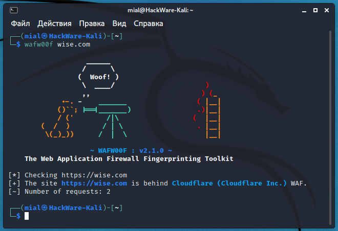
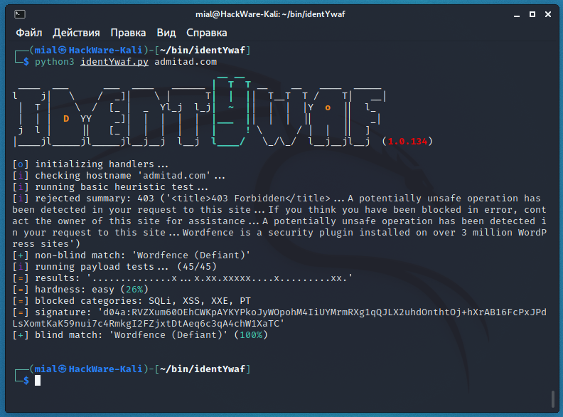
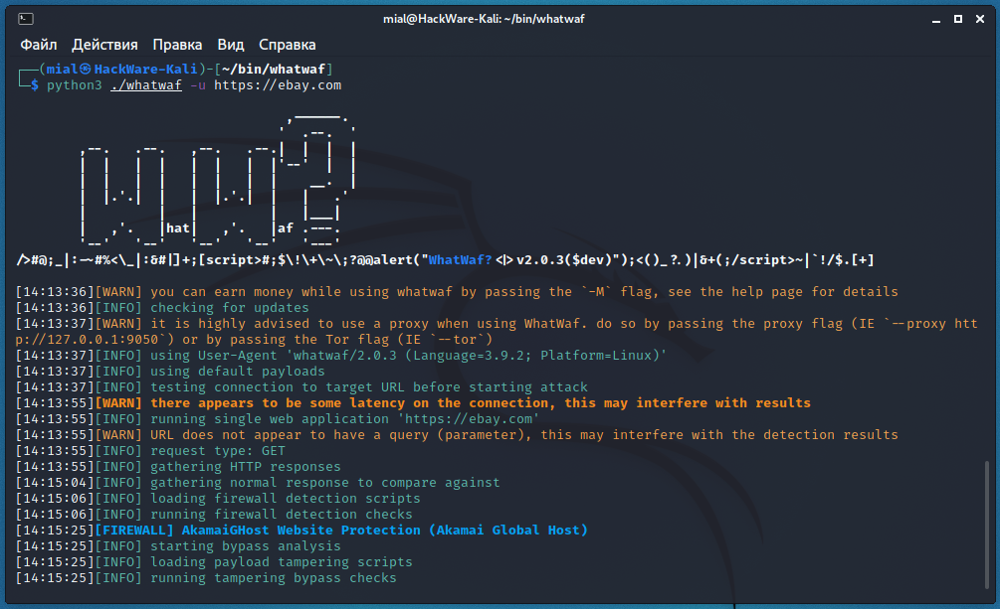

###### How to detect and identify the type of Web Application Firewall (WAF)

The [wafw00f](https://en.kali.tools/?p=1613) program very quickly and accurately detects the WAF type for the specified site. 

```
wafw00f URL
```

For example:

```
wafw00f wise.com
```




[identityYwaf](https://en.kali.tools/?p=1591) is another easy-to-use yet powerful program. Similar to the previous one, this is an identification tool that can recognize the type of web security (eg WAF) based on the server's response. Moreover, this tool makes additional queries to determine which vulnerability categories the WAF is targeting.

An example of a web application firewall scan:

```
python3 identYwaf.py admitad.com
```



[WhatWaf](https://en.kali.tools/?p=1603) is an advanced web application security detection tool that aims to give you an answer to the question, “Does a web server use WAF, and which one?” In the course of its work, WhatWaf detects the presence and type of a web application firewall and tries to find bypasses for the specified firewall on the specified target.

For example:

```
python3 .``/whatwaf` `-u https:``//ebay``.com
```



Please note that you can specify the address of a page with parameters as a URL (for example, https://miloserdov.org/?p=6533). Moreover, it is even recommended – the parameters will be used to transfer the payload, which will allow you to more accurately determine how to bypass WAF.

###### Online service for detecting Web Application Firewalls 

I have collected all the considered tools on the page of one online WAF (Web Application Firewall) detection and identification service: https://w-e-b.site/?act=wafw00f