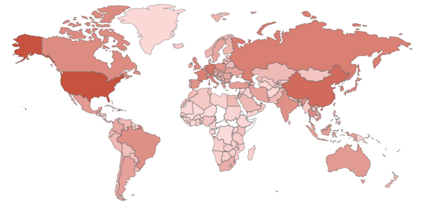
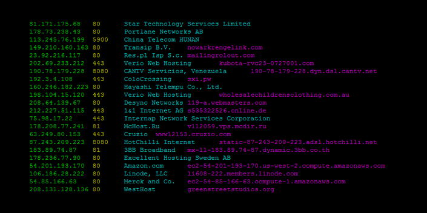

Everyone knows [Shodan](https://www.shodan.io/). Similar principle of operation, like Google Dorking, only on different input data.



Google indexes pages and materials hosted on www servers. Shodan indexes all devices connected to the internet. Not only web servers, but also printers and network devices, webcams, voip phones, washing machines, refrigerators, gas station pumps, whole IoT and other strange things connected to the Internet. It’s like running [nmap](https://nmap.org/) and doing active reconnaissance for the entire Internet. Thanks to Shodan we can check the information on the stage of intelligence gathering ([OSINT](https://en.wikipedia.org/wiki/Open-source_intelligence)), leave no traces of our intelligence, without arousing the suspicion of our target.

## Basic Shodan Queries

**city:** - Find devices in a particular city. Example: **city:**“México”

**country:** - Find devices in a particular country. Example: **country:**“MX”

**geo:** - Find devices by giving geographical coordinates. Example: **geo:**“89.256487,20.111111”

**hostname:** - Find devices matching the hostname. Example: **server:** “gws” **hostname:**“google”

**net:** - Find devices based on an IP address or /x CIDR. Example: **net:**210.214.0.0/16

**os:** - Find devices based on operating system. Example: **os:**“Windows IIS”

**port:** - Find devices based on open ports. Example: apache **port:**8080

**before/after:** - Find devices before or after between a given time. Example: apache **after:**01/01/2010 **before:**01/09/2010

Of course there is more and you can also combine this queries to make better results. Check official [documentation](https://help.shodan.io/the-basics/search-query-fundamentals).

## Examples

Here are some examples of Shodan Dorks I used in the past (one per line). Copy paste it to the web browser and check how the queries were built.

```
https://www.shodan.io/search?query=Hipcam RealServer/V1.0
https://www.shodan.io/search?query=”Active Management Technology”
https://www.shodan.io/search?query=Server%3A+uc-httpd+1.0.0
https://www.shodan.io/search?query=http.html%3A%2Fdana-na
https://www.shodan.io/search?query=http.title%3A%22Index+of+%2F%22+http.html%3A%22.pem%22
https://www.shodan.io/search?query=%22220%22+%22230+Login+successful.%22+port%3A21
https://www.shodan.io/search?query=HP-ILO-4+%21%22HP-ILO-4%2F2.53%22+%21%22HP-ILO-4%2F2.54%22+%21%22HP-ILO-4%2F2.55%22+%21%22HP-ILO-4%2F2.60%22+%21%22HP-ILO-4%2F2.61%22+%21%22HP-ILO-4%2F2.62%22+%21%22HP-iLO-4%2F2.70%22+port%3A1900
https://www.shodan.io/search?query=%22Docker+Containers%3A%22+port%3A2375
https://www.shodan.io/search?query=%22MongoDB+Server+Information%22+port%3A27017+-authentication
https://www.shodan.io/search?query=Microsoft-IIS/6.0 – CVE-2017-7269 (https://github.com/edwardz246003/IIS_exploit)
https://www.shodan.io/search?query=’Microsoft-IIS/7.5′ ‘It works!’ -‘Content-Type’ -‘Set-Cookie’ – Hunting Red Team Empire C2 Infrastructure
https://www.shodan.io/search?query=”Active Management Technology”
https://www.shodan.io/search?query=”Standard Manageability” – CVE-2017-5689
https://www.shodan.io/search?query=GoAhead 5ccc069c403ebaf9f0171e9517f40e41 – CVE-2017-8221,CVE-2017-8222,CVE-2017-8223,CVE-2017-8224,CVE-2017-8225
https://www.shodan.io/search?query=title:”RAKO Bridge Control Panel”
https://www.shodan.io/search?query=PK5001Z login org:”CenturyLink” – CVE-2016-10401
https://www.shodan.io/search?query=Server%3A+uc-httpd+1.0.0
https://www.shodan.io/search?query=http.favicon.hash%3A1485257654 – SonarQube installations
https://www.shodan.io/search?query=title%3ASecuritySpy – SecuritySpy web cam portals
https://www.shodan.io/search?query=port%3A2375+product%3A%22Docker%22 – Docker installations
https://www.shodan.io/search?query=port%3A%222379%22+product%3A%22etcd%22 – elweb.co/the-security-footgun-in-etcd/
https://www.shodan.io/search?query=http.favicon.hash%381586312 – Default Jenkins installations
https://www.shodan.io/search?query=WASRemoteRuntimeVersion – IBM WebSphere version disclosure
https://www.shodan.io/search?query=var+isDefaultPwd+%3D+%271%27%3B – CVE-2018-7900
https://www.shodan.io/search?query=http.html%3A%2Fdana-na
https://www.shodan.io/search?query=http.title%3A%22Index+of+%2F%22+http.html%3A%22.pem%22
https://www.shodan.io/search?query=%22220%22+%22230+Login+successful.%22+port%3A21
https://www.shodan.io/search?query=%22Intel%28R%29+Active+Management+Technology%22+port%3A623%2C664%2C16992%2C16993%2C16994%2C16995 – Intel Active Management CVE-201(7|9|8)
https://www.shodan.io/search?query=HP-ILO-4+%21%22HP-ILO-4%2F2.53%22+%21%22HP-ILO-4%2F2.54%22+%21%22HP-ILO-4%2F2.55%22+%21%22HP-ILO-4%2F2.60%22+%21%22HP-ILO-4%2F2.61%22+%21%22HP-ILO-4%2F2.62%22+%21%22HP-iLO-4%2F2.70%22+port%3A1900
https://www.shodan.io/search?query=%22Docker+Containers%3A%22+port%3A2375
https://www.shodan.io/search?query=%22MongoDB+Server+Information%22+port%3A27017+-authentication
https://www.shodan.io/search?query=http.title%3A%22Priv8+Mailer%22 – Detect PHP Mailer
https://www.shodan.io/search?query=http.favicon.hash%3A116323821 – Detect Spring Boot
https://www.shodan.io/search?query=http.favicon.hash%3A-335242539 – Detect F5 BIG-IP devices
https://www.shodan.io/search?query=http.favicon.hash%3A442749392 – Detect Microsoft Exchange 2010
https://www.shodan.io/search?query=http.favicon.hash%3A679065580 – Detect Loxone Smart Homes
https://www.shodan.io/search?query=aclara+port%3A%2280%22 – Detect Aclara Smart Meter
https://www.shodan.io/search?query=PLC+name%3A+S7_Turbine – Detect S7 PLC Turbine
https://www.shodan.io/search?query=os%3A%22Playstation+4%22 – Detect Sony Playstation 4 systems
https://www.shodan.io/search?query=title%3A%22octoprint%22 – Detect RaspberryPi Octoprint 3D printers
https://www.shodan.io/search?query=http.html_hash%3A-1467534799 – Detect Predator The Thief malware
https://images.shodan.io/?query=port%3A554+rtsp
```

## Shodan dork list

Here is Shodan dork list with some other examples ready to use.

**Citrix** - Find Citrix Gateway. Example: `title:"citrix gateway"`

**Wifi Passwords** - Helps to find the cleartext wifi passwords in Shodan. Example: `html:"def_wirelesspassword"`

**Surveillance Cams** - With username admin and password. Example: `NETSurveillance uc-httpd`

**Fuel Pumps connected to internet** - No auth required to access CLI terminal. Example: `"privileged command" GET`

**Windows RDP Password** - But may contain secondary windows auth. Example: `"\x03\x00\x00\x0b\x06\xd0\x00\x00\x124\x00"`

**Mongo DB servers** - It may give info about mongo db servers and dashboard. Example: `"MongoDB Server Information" port:27017 -authentication`

**FTP servers allowing anonymous access** - Complete Anon access. Example: `"220" "230 Login successful." port:21`

**Jenkins** - Jenkins Unrestricted Dashboard. Example: `x-jenkins 200`

**Hacked routers** - Routers which got compromised. Example: `hacked-router-help-sos`

**Open ATM** - May allow for ATM Access availability. Example: `NCR Port:"161"`

**Telnet Access** - NO password required for telnet access. Example: `port:23 console gateway`

**Misconfigured Wordpress Sites** - The wp-config.php if accessed can give out the database credentials. Example: `http.html:"* The wp-config.php creation script uses this file"`

**Hiring** - Find sites hiring. Example: `"X-Recruiting:"`

**Android Root Bridge** - Find android root bridges with port 5555. Example: `"Android Debug Bridge" "Device" port:5555`

**Etherium Miners** - Shows the miners running ETH. Example: `"ETH - Total speed"`

**Tesla Powerpack charging Status** - Helps to find the charging status of tesla powerpack. Example: `http.title:"Tesla PowerPack System" http.component:"d3" -ga3ca4f2`

You can also check this repo for more

> https://github.com/litt1eb0yy/Awesome-Dorks/blob/master/Shodan-dorks.txt
>
> https://github.com/JavierOlmedo/shodan-filters
>
> https://github.com/jakejarvis/awesome-shodan-queries

## Shodan Command-Line Interface

The [Shodan command-line interface](https://cli.shodan.io/) (CLI) is packaged with the official Python library for Shodan, which means if you’re running the latest version of the library you already have access to the CLI. The Shodan CLI has a lot of commands, check this [website](https://cli.shodan.io/) to see all of them. For the full list of commands just run the tool without any arguments:

```
shodan
```

Example:

```
shodan search --fields ip_str,port,org,hostnames microsoft iis 6.0
```



## Automation

Of course, there are tons of interesting programs and scripts that use Shodan database. Here are a few that I like and find useful. All these tools use [Shodan API](https://developer.shodan.io/) which should be configured in each tool before run. Some of the functions are limited in free Shodan version. It is worth to register and buy full account. Every Black Friday there is always big discount for this.

> https://github.com/random-robbie/My-Shodan-Scripts
>
> https://github.com/HatBashBR/ShodanHat
>
> https://github.com/BullsEye0/shodan-eye
>
> https://github.com/shodansploit/shodansploit
>
> https://github.com/n0x08/ShodanTools
>
> https://github.com/woj-ciech/Kamerka-GUI
>
> https://github.com/Dheerajmadhukar/karma_v2

### Bonus - IP Cameras Default Passwords Directory

Manufacturer List Default Passwords

```
ACTi: admin/123456 or Admin/123456
Amcrest: admin/admin
American Dynamics: admin/admin or admin/9999 
Arecont Vision: none
AvertX: admin/1234
Avigilon: Previously admin/admin, changed to Administrator/<blank> in later firmware versions
Axis: Traditionally root/pass, new Axis cameras require password creation during first login (note that root/pass may be used for ONVIF access, but logging into the camera requires root password creation)
Basler: admin/admin
Bosch: None required, but new firmwares (6.0+) prompt users to create passwords on first login
Brickcom: admin/admin
Canon: root/camera
Cisco: No default password, requires creation during first login
Dahua: Requires password creation on first login. Previously this process was recommended but could be canceled; older models default to admin/admin
Digital Watchdog: admin/admin
DRS: admin/1234
DVTel: Admin/1234
DynaColor: Admin/1234
FLIR: admin/fliradmin
FLIR (Dahua OEM): admin/admin
FLIR (Quasar/Ariel): admin/admin
Foscam: admin/<blank>
GeoVision: admin/admin
Grandstream: admin/admin
Hanwha: admin/no default password, must be created during initial setup
Hikvision: Firmware 5.3.0 and up requires unique password creation; previously admin/12345
Honeywell: admin/1234
IndigoVision (Ultra): none
IndigoVision (BX/GX): Admin/1234
Intellio: admin/admin
Interlogix admin/1234
IQinVision: root/system
IPX-DDK: root/admin or root/Admin
JVC: admin/jvc
Longse: admin/12345
Lorex: admin/admin
LTS: Requires unique password creation; previously admin/12345
March Networks: admin/<blank>
Mobotix: admin/meinsm
Northern: Firmware 5.3.0 and up requires unique password creation; previously admin/12345
Oncam: admin/admin
Panasonic: Firmware 2.40 and up requires username/password creation; previously admin/12345
Pelco: New firmwares require unique password creation; previously admin/admin
Pixord: admin/admin
Q-See: admin/admin or admin/123456
Reolink: admin/<blank>
Samsung Electronics: root/root or admin/4321
Samsung Techwin (old): admin/1111111
Samsung (new): Previously admin/4321, but new firmwares require unique password creation
Sanyo: admin/admin
Scallop: admin/password
Sentry360 (mini): admin/1234
Sentry360 (pro): none  
Sony: admin/admin
Speco: admin/1234
Stardot: admin/admin
Starvedia: admin/<blank>
Sunell: admin/admin
SV3C: admin/123456
Swann: admin/12345 
Trendnet: admin/admin
Toshiba: root/ikwd
VideoIQ: supervisor/supervisor
Vivotek: root/<blank>
Ubiquiti: ubnt/ubnt
Uniview: admin/123456
W-Box (Hikvision OEM, old): admin/wbox123
W-Box (Sunell OEM, new): admin/admin
Wodsee: admin/<blank>
```

Default passwords are always in each manufacturer guide. Use Google to find it.