The first step to attacking any target is conducting reconnaissance, or simply put, gathering information about the target.  

If an application doesn’t use PHP, for instance, there’s no reason to test it for PHP vulnerabilities, and if the organization doesn’t use Amazon Web Services (AWS), you shouldn’t waste time trying to crack its buckets. By understanding how a target works, you can set up a solid foundation for finding vulnerabilities. **Recon skills are what separate a good hacker from an ineffective one.**  

#### Manually Walking Through the Target 

it will help to first manually walk through the application to learn more about it. Try to uncover every feature in the application that users can access by browsing through every page and clicking every link. Access the functionalities that you don’t usually use.  

For example, if you’re hacking Facebook, try to create an event, play a game, and use the payment functionality if you’ve never done so before.  

Sign up for an account at every privilege level to reveal all of the application’s features. For example, on Slack, you can create owners, admins, and members of a workspace. Also create users who are members of different channels under the same workspace. This way, you can see what the application looks like to different users.  

This should give you a rough idea of what the attack surface (all of the different points at which an attacker can attempt to exploit the application) looks like, where the data entry points are, and how different users interact with each other. Then you can start a more in-depth recon process: finding out the technology and structure of an application.  

#### Scope Discovery  

Let’s now dive into recon itself. First, always verify the target’s scope. A program’s scope on its policy page specifies which subdomains, products, and applications you’re allowed to attack. Carefully verify which of the company’s assets are in scope to avoid overstepping boundaries during the recon
and hacking process.  

###### WHOIS and Reverse WHOIS  

When companies or individuals register a domain name, they need to supply identifying information, such as their mailing address, phone number, and email address, to a domain registrar. Anyone can then query this information by using the whois command, which searches for the registrant and owner information of each known domain. You might be able to find the associated contact information, such as an email, name, address, or phone number: `$ whois facebook.com`

This information is not always available, as some organizations and individuals use a service called domain privacy, in which a third-party service provider replaces the user’s information with that of a forwarding service.  

You could then conduct a reverse WHOIS search, searching a database by using an organization name, a phone number, or an email address to find domains registered with it. This way, you can find all the domains that belong to the same owner. Reverse WHOIS is extremely useful for finding obscure or internal domains not otherwise disclosed to the public. Use a public reverse WHOIS tool like **[ViewDNS.info](https://viewdns.info/reversewhois/)** (https://viewdns.info/reversewhois/) to conduct this search. WHOIS and reverse WHOIS will give you a good set of top-level domains to work with.  

###### IP Addresses  

Another way of discovering your target’s top-level domains is to locate IP addresses. Find the IP address of a domain you know by running the **nslookup** command. You can see here that facebook.com is located at 157.240.2.35:  

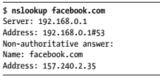

Once you’ve found the IP address of the known domain, perform a **reverse IP lookup**. Reverse IP searches look for domains hosted on the same server, given an IP or domain. You can also use ViewDNS.info for this.  

Also run the whois command on an IP address, and then see if the target has a dedicated IP range by checking the NetRange field. An IP range is a block of IP addresses that all belong to the same organization. If the organization has a dedicated IP range, any IP you find in that range belongs to that organization:  

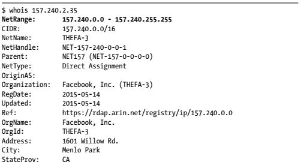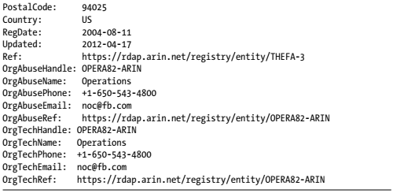

Another way of finding IP addresses in scope is by looking at autonomous systems, which are routable networks within the public internet. Autonomous system numbers (ASNs) identify the owners of these networks. By checking if two IP addresses share an ASN, you can determine whether the IPs belong to the same owner  

To figure out if a company owns a dedicated IP range, run several IP-to-ASN translations to see if the IP addresses map to a single ASN. If many addresses within a range belong to the same ASN, the organization might have a dedicated IP range. From the following output, we can deduce that any IP within the 157.240.2.21 to 157.240.2.34 range probably belongs to Facebook:  

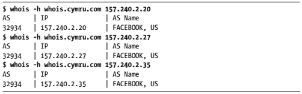

The `-h` flag in the whois command **sets the WHOIS server to retrieve information from**, and `whois.cymru.com` is a database that translates IPs to ASNs. If the company has a dedicated IP range and doesn’t mark those addresses as out of scope, you could plan to attack every IP in that range.  

###### Certificate Parsing  

Another way of finding hosts is to take advantage of the Secure Sockets Layer (SSL) certificates used to encrypt web traffic. An SSL certificate’s Subject Alternative Name field lets certificate owners specify additional hostnames that use the same certificate, so you can find those hostnames by parsing this field. Use online databases like `crt.sh, Censys, and Cert Spotter` to find certificates for a domain.  

For example, by running a certificate search using crt.sh for facebook.com, we can find Facebook’s SSL certificate. You’ll see that many other domain names belonging to Facebook are listed:  

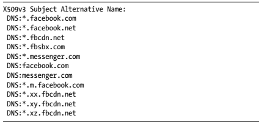

The [crt.sh](https://crt.sh/) website also has a useful utility that lets you retrieve the information in JSON format, rather than HTML, for easier parsing. Just add the URL parameter output=json to the request URL: https://crt.sh/?q=facebook.com&output=json.  

###### Subdomain Enumeration  

After finding as many domains on the target as possible, locate as many subdomains on those domains as you can. Each subdomain represents a new angle for attacking the network. The best way to enumerate subdomains is to use automation.  

Tools like `Sublist3r, SubBrute, Amass, and Gobuster` can enumerate subdomains automatically with a variety of wordlists and strategies.   

You can build a tool that combines the results of multiple tools to achieve the best results.  

Here is a detailed resource for subdomain enumeration.

###### Service Enumeration  

Next, enumerate the services hosted on the machines you’ve found. Since services often run on default ports, a good way to find them is by port-scanning the machine with either active or passive scanning.  

In active scanning, you directly engage with the server. Active scanning tools send requests to connect to the target machine’s ports to look for open ones. You can use tools like Nmap or Masscan for active scanning.
For example, this simple Nmap command reveals the open ports on scanme.nmap.org:  

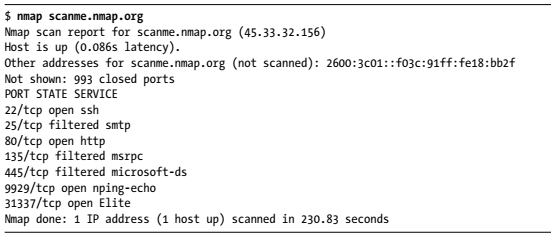

On the other hand, in passive scanning, you use third-party resources to learn about a machine’s ports without interacting with the server. Passive scanning is stealthier and helps attackers avoid detection. To find services on a machine without actively scanning it, you can use `Shodan`, a search engine that lets the user find machines connected to the internet.  
Check [Here](https://github.com/BU9D4DDY/Web_Penetration_Testing/blob/main/Reconnaissance/Dorking/Shodan%20Dorking.md)

With Shodan, you can discover the presence of webcams, web servers, or even power plants based on criteria such as hostnames or IP addresses. For example, if you run a Shodan search on scanme.nmap.org’s IP address, 45.33.32.156, you get the result   

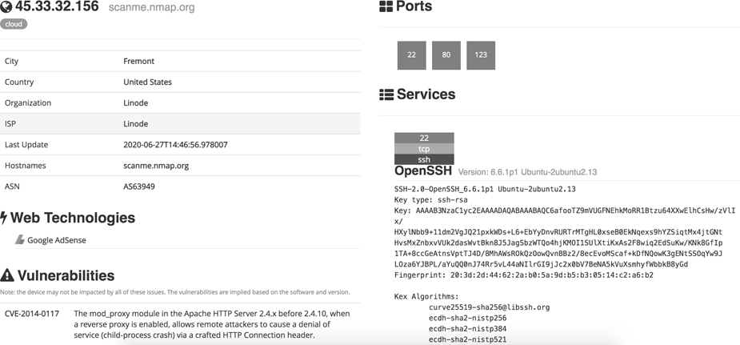

You can see that the search yields different data than our port scan, and provides additional information about the server.     

###### Directory Brute-Forcing  

The next thing you can do to discover more of the site’s attack surface is brute-force the directories of the web servers you’ve found. Finding directories on servers is valuable, because through them, you might discover hidden admin panels, configuration files, password files, outdated functionalities, database copies, and source code files.   

**Directory brute-forcing can sometimes allow you to directly take over a server!**  

Even if you can’t find any immediate exploits, directory information often tells you about the structure and technology of an application. For example, a pathname that includes phpmyadmin usually means that the application is built with PHP.  

You can use `Dirsearch` or` Gobuster` for directory brute-forcing. These tools use wordlists to construct URLs, and then request these URLs from a web server. If the server responds with a status code in the `200 `range, the directory or file exists. This means you can browse to the page and see what  the application is hosting there. A status code of `404 `means that the directory or file doesn’t exist, while `403 `means it exists but is protected. **Examine `403 `pages carefully to see if you can bypass the protection to access the content.**  

Here’s an example of running a Dirsearch command. The `-u `flag specifies the hostname, and the `-e` flag specifies the file extension to use when constructing URLs:  

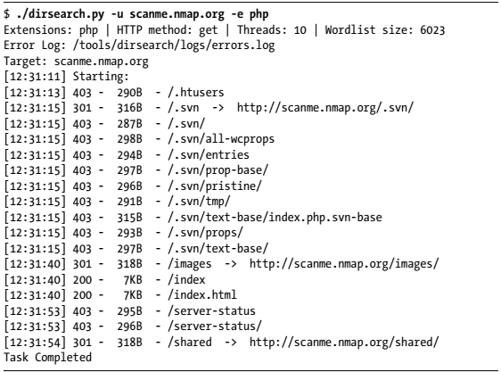

Gobuster’s Dir mode is used to find additional content on a specific domain or subdomain. This includes hidden directories and files. In this mode, you can use the `-u` flag to specify the domain or subdomain you want to brute-force and `-w` to specify the wordlist you want to use:  

`gobuster dir -u target_url -w wordlist  `

Manually visiting all the pages you’ve found through brute-forcing can be time-consuming. Instead, use a *screenshot* tool like **EyeWitness** (https://github.com/FortyNorthSecurity/EyeWitness/) or **Snapper** (https://github.com/dxa4481/Snapper/) to automatically verify that a page is hosted on each location. EyeWitness accepts a list of URLs and takes screenshots of each page. In a photo gallery app, you can quickly skim these to find the interesting-looking ones. Keep an eye out for hidden services, such as developer or admin panels, directory listing pages, analytics pages, and pages that look outdated and illmaintained. These are all common places for vulnerabilities to manifest.  

###### Spidering the Site  

Another way of discovering directories and paths is through web spidering, or web crawling, a process used to identify all pages on a site. A web spider tool starts with a page to visit. It then identifies all the URLs embedded on the page and visits them. By recursively visiting all URLs found on all pages of a
site, the web spider can uncover many hidden endpoints in an application.  

OWASP Zed Attack Proxy (ZAP) at https://www.zaproxy.org/ has a built-in web spider you can use  , Access its spider tool by opening ZAP and choosing Tools-> Spider  

Burp Suite has an equivalent tool called the crawler, but I prefer ZAP’s spider.  

###### Third-Party Hosting  

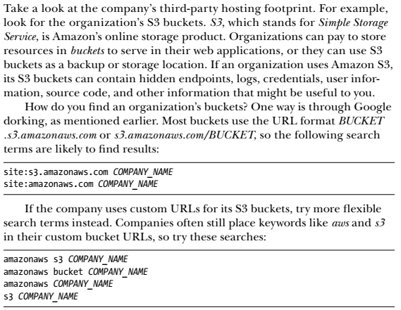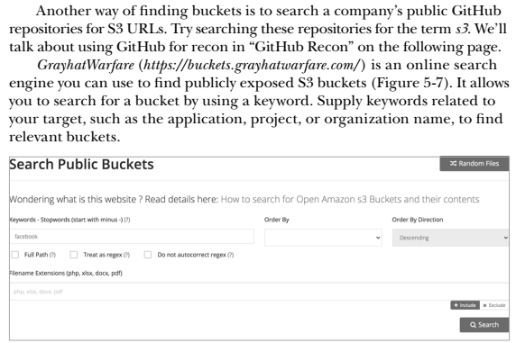

Finally, you can try to brute-force buckets by using keywords. [Lazys3](https://github.com/nahamsec/lazys3/) is a tool that helps you do this. It relies on a wordlist to guess buckets that are permutations of common bucket names.  

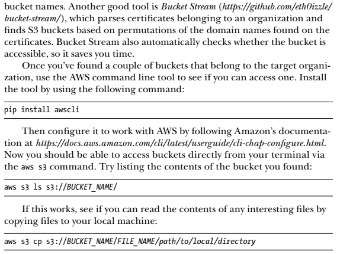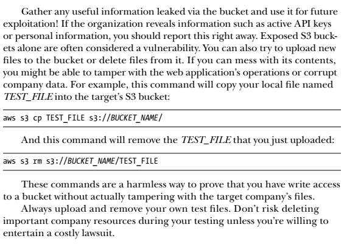

###### GitHub Recon

For each repository, pay special attention to the Issues and Commits sections. These sections are full of potential info leaks: they could point attackers to unresolved bugs, problematic code, and the most recent code fixes and security patches.  

Recent code changes that haven’t stood the test of time are more likely to contain bugs. Look at any protection mechanisms implemented to see if you can bypass them.  You can also search the Code section for potentially vulnerable code snippets.   

look for hardcoded secrets such as API keys, encryption keys, and database passwords. Search the organization’s repositories for terms like key, secret, and password to locate hardcoded user credentials that you can use to access internal systems. After you’ve found leaked credentials, you can use [KeyHacks](https://github.com/streaak/keyhacks/) to check if the credentials are valid and learn how to use them to access the target’s services.  

You should also search for sensitive functionalities in the project. See if any of the source code deals with important functions such as authentication, password reset, state changing actions, or private info reads. Pay attention to code that deals with user input, such as HTTP request parameters, HTTP headers, HTTP request paths, database entries, file reads, and file uploads, because they provide potential entry points for attackers to exploit the application’s vulnerabilities.  

Look for any configuration files, as they allow you to gather more information about your infrastructure. Also, search for old endpoints and S3 bucket URLs that you can attack. Record these files for further review in the future.  

Outdated dependencies and the unchecked use of dangerous functions are also a huge source of bugs. Pay attention to dependencies and imports being used and go through the versions list to see if they’re outdated. Record any outdated dependencies. You can use this information later to look for publicly disclosed vulnerabilities that would work on your target.  

You can check all about GitHub Recon [HERE](https://github.com/BU9D4DDY/Web_Penetration_Testing/blob/main/Reconnaissance/Dorking/Github%20Recon.md)

#### [Google Dorking](https://github.com/BU9D4DDY/Web_Penetration_Testing/blob/main/Reconnaissance/Dorking/Google%20Dorking.md)

advanced Google searches are a powerful technique that hackers often use to perform recon.  
You Can Check It [Here](https://github.com/BU9D4DDY/Web_Penetration_Testing/blob/main/Reconnaissance/Dorking/Google%20Dorking.md)  

#### Other Sneaky OSINT Techniques

First, check the company’s job posts for engineering positions.
Engineering job listings often reveal the technologies the company uses.  

If you can’t find relevant job posts, search for employees’ profiles on LinkedIn, and read employees’ personal blogs or their engineering questions on forums like Stack Overflow and Quora. The expertise of a company’s top employees often reflects the technology used in development.  

Another source of information is the employees’ Google calendars. People’s work calendars often contain meeting notes, slides, and sometimes even login credentials. If an employee shares their calendars with the public by accident, you could gain access to these.  

The organization or its employees’ social media pages might also leak valuable information.  
**For example, hackers have actually discovered sets of valid credentials on Post-it Notes visible in the background of office selfies!**  

If the company has an engineering mailing list, sign up for it to gain insight into the company’s technology and development process .

Also check the company’s SlideShare or Pastebin accounts. Sometimes, when organizations present at conferences or have internal meetings, they upload slides to SlideShare for reference. You might be able to find information about the
technology stack and security challenges faced by the company. Pastebin (https://pastebin.com/) is a website for pasting and storing text online for a short time. People use it to share text across machines or with others. Engineers sometimes use it to share source code or server logs with their colleagues for viewing or collaboration, so it could be a great source of information. You might also find uploaded credentials and development comments. Go to Pastebin, search for the target’s organization name, and see what happens! You can also use automated tools like [PasteHunter](https://github.com/kevthehermit/PasteHunter/) to scan for publicly pasted data.    

Lastly, consult archive websites like the Wayback Machine (https://archive.org/web/), a digital record of internet content . It records a site’s content at various points in time. Using the Wayback Machine, you can find old endpoints, directory listings, forgotten subdomains, URLs, and files that are outdated but still in use. Tomnomnom’s tool Waybackurls (https://github.com/tomnomnom/waybackurls/) can automatically extract endpoints and URLs from the Wayback Machine.  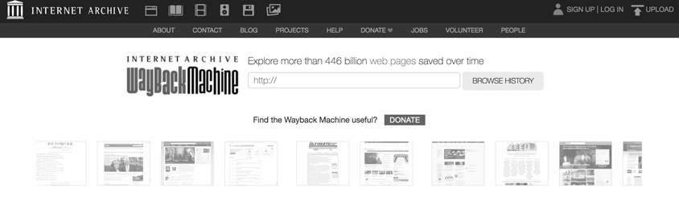

#### Tech Stack Fingerprinting

Fingerprinting techniques can help you understand the target application even better. Fingerprinting is identifying the software brands and versions that a machine or an application uses. This information allows you to perform targeted attacks on the application, because you can search for any known misconfigurations and publicly disclosed vulnerabilities related to a particular version.   

For example, if you know the server is using an old version of Apache that could be impacted by a disclosed vulnerability, you can immediately attempt to attack the server using it.  

The security community classifies known vulnerabilities as Common Vulnerabilities and Exposures (CVEs) and gives each CVE a number for reference. Search for them on the CVE database (https://cve.mitre.org/cve/search_cve_list.html).  

The simplest way of fingerprinting an application is to engage with the application directly. First, run `Nmap `on a machine with the `-sV` flag on to enable version detection on the port scan. 
Next, in Burp, send an HTTP request to the server to check the HTTP headers used to gain insight into the tech stack. A server might leak many pieces of information useful for fingerprinting its technology:  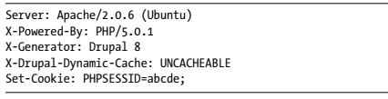
HTTP headers like Server and X-Powered-By are good indicators of technologies. The Server header often reveals the software versions running on the server. X-Powered-By reveals the server or scripting language used.
Also, certain headers are used only by specific technologies. For example, only Drupal uses X-Generator and X-Drupal-Dynamic-Cache. Technology-specific cookies such as PHPSESSID are also clues; if a server sends back a cookie named PHPSESSID, it’s probably developed using PHP.  

The HTML source code of web pages can also provide clues. Many web frameworks or other technologies will embed a signature in source code.
**Right-click** a page, select **View Source Code**, and press **CTRL-F** to search for phrases like powered by, built with, and running. For instance, you might find Powered by: WordPress 3.3.2 written in the source.  

Several applications can automate this process. [Wappalyzer](https://www.wappalyzer.com/) is a browser extension that identifies content management systems, frameworks, and programming languages used on a site. [BuiltWith](https://builtwith.com/) is a website that shows you which web technologies a site is built with. [StackShare](https://stackshare.io/) is an online platform that allows developers to share the tech they use. You can use it to find out if the organization’s developers have posted their tech stack. Finally, **Retire.js** is a tool that detects outdated JavaScript libraries and Node.js packages. You can use it to check for outdated technologies on a site.  

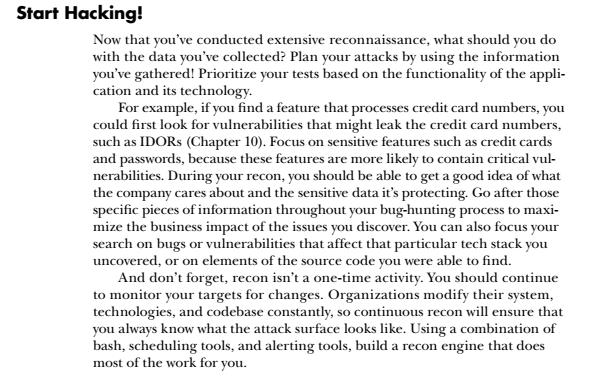

> Here You Can Find Almost All The Tools Used For Recon:
>
> https://github.com/BU9D4DDY/Web_Penetration_Testing/blob/main/Reconnaissance/AllTools.md

### **DNS Discovery**

| Name                | Link                                            |
| ------------------- | ----------------------------------------------- |
| Sublist3r           | https://github.com/aboul3la/Sublist3r           |
| enumall             | https://github.com/jhaddix/domain/              |
| massdns             | https://github.com/blechschmidt/massdns         |
| altdns              | https://github.com/infosec-au/altdns            |
| brutesubs           | https://github.com/anshumanbh/brutesubs         |
| dns-parallel-prober | https://github.com/lorenzog/dns-parallel-prober |
| dnscan              | https://github.com/rbsec/dnscan                 |
| Knockpy             | https://github.com/guelfoweb/knock              |

### **Port scan**

| Name    | Link                                         |
| ------- | -------------------------------------------- |
| nmap    | [https://nmap.org](https://nmap.org/)        |
| masscan | https://github.com/robertdavidgraham/masscan |

### **Screenshots**

| Name           | Link                                            |
| -------------- | ----------------------------------------------- |
| EyeWitness     | https://github.com/ChrisTruncer/EyeWitness      |
| httpscreenshot | https://github.com/breenmachine/httpscreenshot/ |

### **Web Discovery**

| Name      | Link                                        |
| --------- | ------------------------------------------- |
| DirBuster | https://sourceforge.net/projects/dirbuster/ |
| dirb      | http://dirb.sourceforge.net/                |
| ilebuster | https://github.com/henshin/filebuster       |
| gobuster  | https://github.com/OJ/gobuster              |
| dirsearch | https://github.com/maurosoria/dirsearch     |

### **Github**

| Name            | Link                                          |
| --------------- | --------------------------------------------- |
| Gitrob          | https://github.com/michenriksen/gitrob        |
| git-all-secrets | https://github.com/anshumanbh/git-all-secrets |
| truffleHog      | https://github.com/dxa4481/truffleHog         |
| git-secrets     | https://github.com/awslabs/git-secrets        |
| repo-supervisor | https://github.com/auth0/repo-supervisor      |

### **S3**

| Name          | Link                                          |
| ------------- | --------------------------------------------- |
| sandcastle    | https://github.com/yasinS/sandcastle          |
| bucket_finder | https://digi.ninja/projects/bucket_finder.php |

### **Google Dorks**

| Name       | Link                                     |
| ---------- | ---------------------------------------- |
| Goohak     | https://github.com/1N3/Goohak/           |
| GoogD0rker | https://github.com/ZephrFish/GoogD0rker/ |

### **Hidden parameters**

| Name     | Link                             |
| -------- | -------------------------------- |
| parameth | https://github.com/mak-/parameth |

### **Old content**

| Name                             | Link                                                         |
| -------------------------------- | ------------------------------------------------------------ |
| Wayback Machine                  | [https://web.archive.org](https://web.archive.org/)          |
| waybackrobots                    | https://gist.github.com/mhmdiaa/2742c5e147d49a804b408bfed3d32d07 |
| waybackurls                      | https://gist.github.com/mhmdiaa/adf6bff70142e5091792841d4b372050 |
| Google (with the time filter on) | [https://google.com](https://google.com/)                    |

### **Asset identification**

| Name                    | Link                                                    |
| ----------------------- | ------------------------------------------------------- |
| Shodan                  | https://shodan.io/                                      |
| Internet Wide Scan Data | [http://Repositoryscans.io](http://repositoryscans.io/) |
| censys                  | [https://censys.io](https://censys.io/)                 |
| Hurricane Electric      | [http://bgp.he.net/](https://bgp.he.net/)               |

### **Frameworks**

| Name            | Link                                        |
| --------------- | ------------------------------------------- |
| Kubebot         | https://github.com/anshumanbh/kubebot       |
| Intrigue        | https://github.com/intrigueio/intrigue-core |
| Sn1per          | https://github.com/1N3/Sn1per/              |
| scantastic-tool | https://github.com/maK-/scantastic-tool/    |
| XRay            | https://github.com/evilsocket/xray          |
| datasploit      | https://github.com/DataSploit/datasploit    |
| Inquisitor      | https://github.com/penafieljlm/inquisitor   |
| Spiderfoot      | https://github.com/smicallef/spiderfoot     |