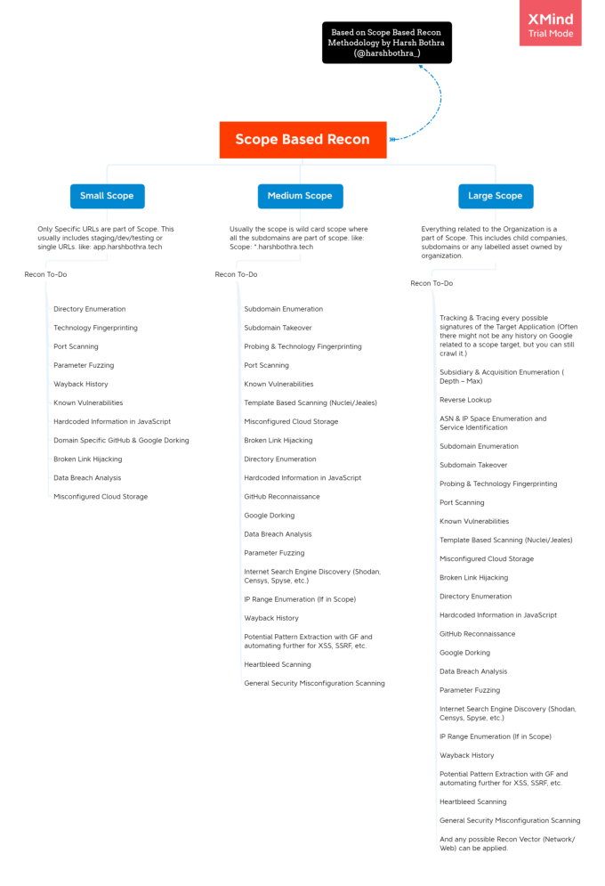

The first step to attacking any target is conducting reconnaissance, or simply put, gathering information about the target.  

If an application doesn’t use PHP, for instance, there’s no reason to test it for PHP vulnerabilities, and if the organization doesn’t use Amazon Web Services (AWS), you shouldn’t waste time trying to crack its buckets. By understanding how a target works, you can set up a solid foundation for finding vulnerabilities. 

**Recon skills are what separate a good hacker from an ineffective one.**  

#### Manually Walking Through the Target 

it will help to first manually walk through the application to learn more about it. Try to uncover every feature in the application that users can access by browsing through every page and clicking every link. Access the functionalities that you don’t usually use.  

For example, if you’re hacking Facebook, try to create an event, play a game, and use the payment functionality if you’ve never done so before.  
Sign up for an account at every privilege level to reveal all of the application’s features. For example, on Slack, you can create owners, admins, and members of a workspace. Also create users who are members of different channels under the same workspace. This way, you can see what the application looks like to different users.  

