> subdomain enumeration

.png)

(1) **Horizontal Enumeration** :

- Discovering the IP space :
    To find an ASN of an organization https://bgp.he.net is a useful website where we can query.
    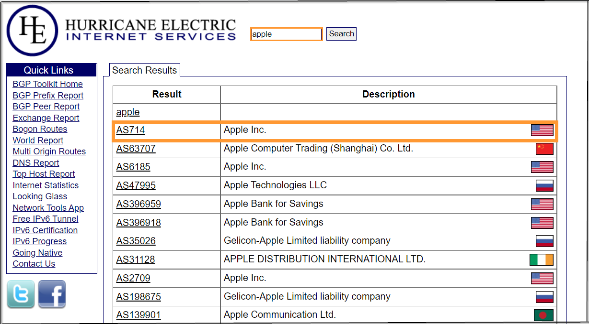

    Now that we have found out the ASN number, next we need to figure out IP ranges within that ASN. For this, we will use **whois** tool.

    ```bash
    whois -h whois.radb.net  -- '-i origin AS714' | grep -Eo "([0-9.]+){4}/[0-9]+" | uniq
    ```

    

- Finding related domains/acquisitions:

    * WhoisXMLAPI :
        [**WhoisXMLAPI** ](https://www.whoisxmlapi.com)is an excellent source that provides a good amount of related domains & acquisitions based on the WHOIS record. 
        Singing up on their platform will assign you **500 free credits** which renew every month.

        Visit https://tools.whoisxmlapi.com/reverse-whois-search . Now searching with the root domain name like **dell.com** will give all the associated domains.
        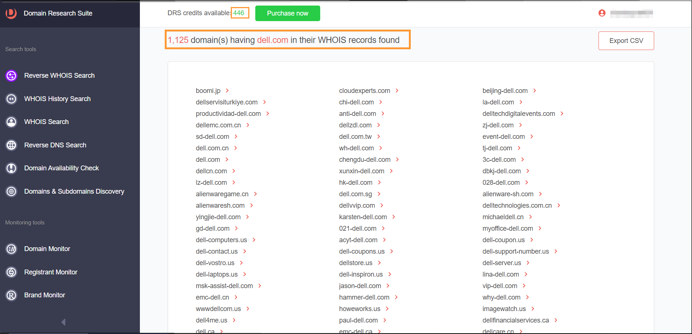
        ---> These are not 100% accurate results, as they contain false positives

    * Whoxy : (this is a paid service)
        [**Whoxy**](https://www.whoxy.com) is yet another great source to perform reverse WHOIS on parameters like Company Name, Registrant Email address, Owner Name. Whoxy has an enormous database of around **329M WHOIS records**.
        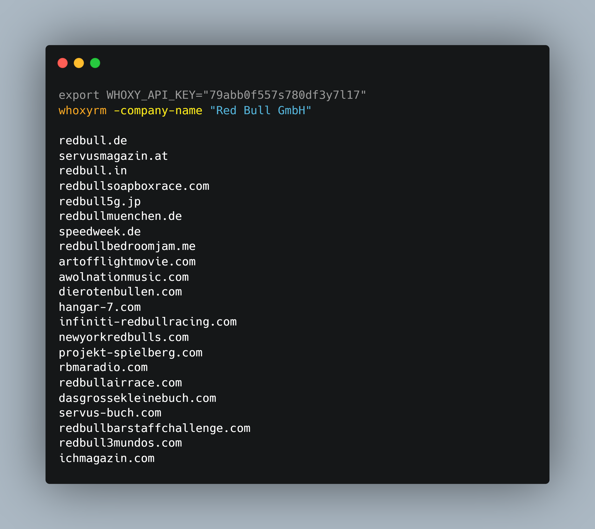

    * Crunchbase :
        another great alternative for finding acquisitions but requires a paid subscription to view all the acquisitions. The trial version allows viewing some of the acquisitions.
        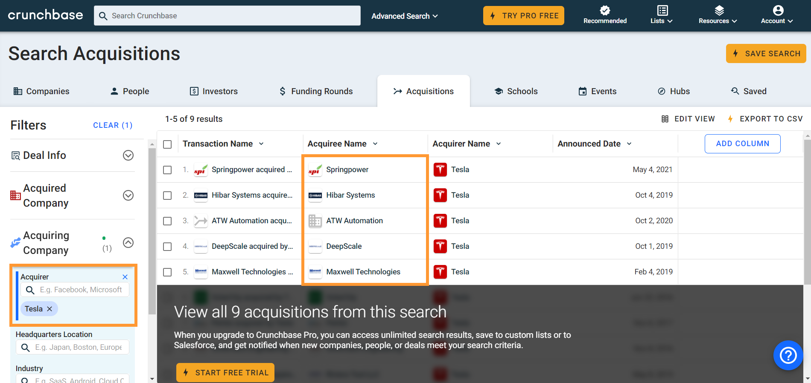

- PTR records (Reverse DNS) :
    Now since we have got to know the IP address ranges from ASN of an organization, we can perform PTR queries on the IP addresses and check for valid hosts.

    PTR records (pointer record) helps us to achieve this. Using [**dnsx**](https://github.com/projectdiscovery/dnsx) tool we can query a PTR record of an IP address and find the associated hostname/domain name.

    **Apple Inc.** 🍎  has **ASN714** which represents IP range **17.0.0.0/8.** So, let's see have to perform reverse DNS.

    <--- Running --->

    We will first need to install 2 tools:
    [**Mapcidr**](https://github.com/projectdiscovery/mapcidr)  :

    ```bash
    GO111MODULE=on go get -v github.com/projectdiscovery/mapcidr/cmd/mapcidr
    ```

    > When an IP range is given to **mapcidr** through stdin(standard input), it performs expansion spitting out each IP address from the range onto a new line:`17.0.0.1`**,** `17.0.0.2`**,** `17.0.0.3`**,** `17.0.0.4`

    [**dnsx** ](https://github.com/projectdiscovery/dnsx) : 

    ```bash
    GO111MODULE=on go get -v github.com/projectdiscovery/dnsx/cmd/dnsx
    ```

    > Now when **dnsx** receives each IP address from stdin, it performs reverse DNS and checks for PTR record. If, found it gives us back the hostname/domain name.

    ```bash
    > hint to move packages after instalation
    └─$ sudo cp /home/kali/go/bin/$$$$$$$ /usr/local/go/bin/
    ```

    ```bash
     echo 17.0.0.0/8 | mapcidr -silent | dnsx -ptr -resp-only -o output.txt
    ```

    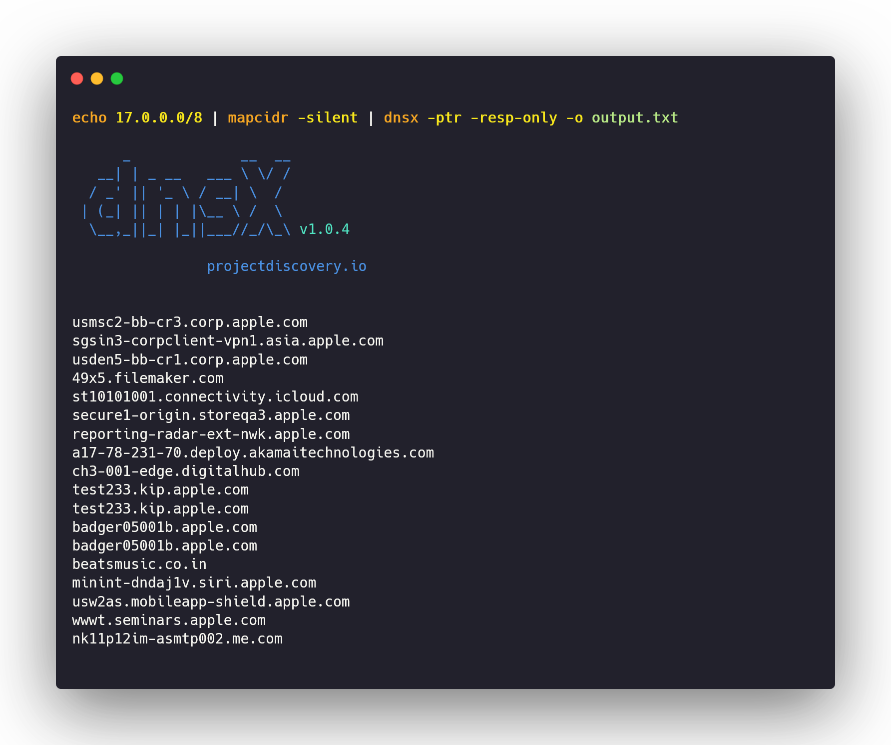

    > **Note:** We can also combine the step of discovering the IP space with reverse DNS lookup into one-liner like:
    >
    > ```bash
    > whois -h whois.radb.net  -- '-i origin AS714' | grep -Eo "([0-9.]+){4}/[0-9]+" | uniq | mapcidr -silent | dnsx -ptr -resp-only
    > ```

- Favicon Hashing :

    The image/icon shown on the left-hand side of a tab is called as **favicon.ico**. This icon is generally fetched from a different source/CDN. Hence, we can find this favicon link from the source code of the website.

    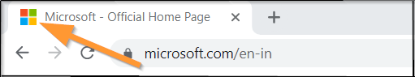

    ###### How to find the favicon.ico link?

    - Visit any website which already posses a favicon ([https://www.microsoft.com](https://www.microsoft.com/en-in))
    - Now, view the source code and find the keyword "**favicon**" in the source code.
    - You will find the link where the favicon is hosted. ([https://c.s-microsoft.com/favicon.ico](https://c.s-microsoft.com/favicon.ico?v2))

    ###### Generating the MurmurHash value:

    To generate the MurmurHash value which is unique to each favicon we will use a tool called **MurMurHash** which is a simple tool used to generate hash for the given favicon.

    ```bash
    git clone https://github.com/Viralmaniar/MurMurHash.git
    
    cd MurMurHash/
    
    pip3 install -r requirements.txt
    ```

    <--- Running --->

    - Upon running the tool, it will ask you to enter the URL for the hash.

    - And after entering the favicon link it will provide you with a unique hash value (**-2057558656**) 

    ```bash
    python3 MurMurHash.py
    ```

    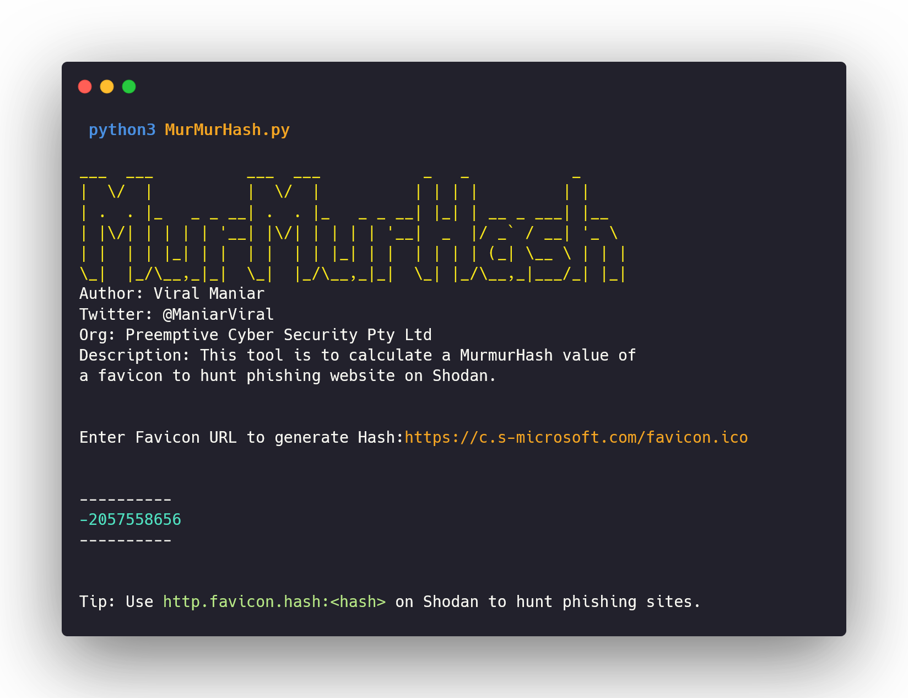

    - Now we query [Shodan](https://www.shodan.io) `http.favicon.hash:<hash>` with that favicon hash.
    - This gave us a whopping **162K assets/hosts**. These all can be subdomains or related domains of the Microsoft organization.
        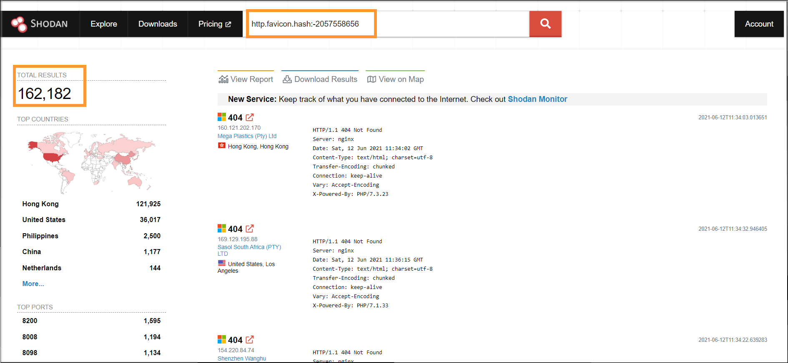

(1) **Vertical Enumeration** :

This includes various intensive techniques which we will see further in this guide.

1.**Passive Techniques**

- Passive Sources (passive subdomain enumeration) :

    A) Passive DNS gathering tools :

     1. [Amass](https://github.com/OWASP/Amass)

        ```bash
        go get -v github.com/OWASP/Amass/v3/...
        ```

        **Setting up Amass config file:**

        - [**Link**](https://gist.github.com/sidxparab/4cd40d6e2f9422a005b06f19919200d0) to my amass config file for reference.

        - By default, amass config file is located at `$HOME/.config/amass/config.ini`

        - Amass uses API keys mentioned in the config to query the third-party passive DNS sources.

        - There are in total **18 services** on which you can signup and assign yourself with a free API key that will be used to query the large datasets.

        - Now let's set up our API keys in the `config.ini`config file.

        - Open the config file in a text editor and then uncomment the required lines and add your API keys

        - Refer to my config file(this is exactly how your amass config file should be). 

            ```ini
            # https://otx.alienvault.com (Free)
            [data_sources.AlienVault]
            [data_sources.AlienVault.Credentials]
            apikey = dca0d4d692a6fd757107333d43d5f284f9a38f245d267b1cd72b4c5c6d5c31
            
            #How to Add 2 API keys for a single service
            
            # https://app.binaryedge.com (Free)
            [data_sources.BinaryEdge]
            ttl = 10080
            [data_sources.BinaryEdge.account1]
            apikey = d749e0d3-ff9e-gcd0-a913-b5e62f6f216a
            [data_sources.BinaryEdge.account2]
            apikey = afdb97ff-t65e-r47f-bba7-c51dc5d83347
            ```

             **Tip**:- After configuring your config file in order to verify whether the API keys have been correctly set up or not you can use this command:-

            ```bash
            amass enum -list -config config.ini
            ```

            <--- Running --->

            - After setting up API keys now we are good to run amass. 

                ```bash
                amass enum -passive -d example.com -config config.ini -o output.txt
                ```

            - **Flags:-**

                - **enum** - Perform DNS enumeration
                - **passive** - passively collect information through the data sources mentioned in the config file.
                - **config** - Specify the location of your config file (default: `$HOME/.config/amass/config.ini` )
                - **o** - Output filename

     2. [Subfinder](https://github.com/projectdiscovery/subfinder)

        ```bash
        GO111MODULE=on go get -v github.com/projectdiscovery/subfinder/v2/cmd/subfinder
        ```

        **Setting up Subfinder config file:**  

        - Subfinder's default config file location is at `$HOME/.config/subfinder/config.yaml` 

        - When you install subfinder for the first time the config file doesn't get generated, hence you should run `subfinder -h` command to get it generated.

        - For subfinder you can obtain free API keys by signing up on 18 Passive DNS sources. (here the list of sources)

        - The subfinder config file follows YAML(YAML Ain't Markup Language) syntax. So, you need to be careful that you don't break the syntax. It's better that you use a text editor and set up syntax highlighting. 

            > **Tip:-** You can verify your YAML config file syntax on [yamllint.com](http://www.yamllint.com)

        - [**Link** ](https://gist.github.com/sidxparab/e981c813f4ad057ed080a75a7fe00f4e)to my subfinder config file for reference.

        - Some passive sources like `Censys` , `PassiveTotal` have 2 keys like APP-Id & Secret. For such sources, both values need to be mentioned with a colon(:) in between them. *(Check how have I mentioned the "Censys" source values-* *`APP-id`**:**`Secret`* *in the below example )*

        - Subfinder automatically detects its config file only if at the default position. 

        ```yaml
        securitytrails: []
        censys:
          - ac244e2f-b635-4581-878a-33f4e79a2c13:dd510d6e-1b6e-4655-83f6-f347b363def9
        shodan:
          - AAAAClP1bJJSRMEYJazgwhJKrggRwKA
        github:
          - d23a554bbc1aabb208c9acfbd2dd41ce7fc9db39
          - asdsd54bbc1aabb208c9acfbd2dd41ce7fc9db39
        passivetotal:
          - sample-email@user.com:sample_password
        ```

        <--- Running --->

        ```bash
        subfinder -d example.com -all -config config.yaml -o output.txt
        ```

        - **Flags:-**

            - **d** - Specify our target domain
            - **all** - Use all passive sources (slow enumeration but more results)
            - **config** - Config file location

            > **Tip:-** To view the sources that require API keys `subfinder -ls` command

     3. [**Assetfinder**](https://github.com/tomnomnom/assetfinder)

        -  It doesn't give any unique subdomains compared to other tools but it's extremely fast.

        ```bash
        go get -u github.com/tomnomnom/assetfinder
        ```

        <--- Running --->

        ```bash
        assetfinder --subs-only example.com > output.txt
        ```

     4. [Findomain](https://github.com/Findomain/Findomain)

        - Has a paid version that offers much more features like subdomain monitoring, resolution, less resource consumption. 
        - Depending on your architecture download binary from [here](https://github.com/Findomain/Findomain/wiki/Installation#using-upstream-precompiled-binaries)

        ```bash
        wget -N -c https://github.com/Findomain/Findomain/releases/latest/download/findomain-linux
        
        mv findomain-linux /usr/local/bin/findomain
        
        chmod 755 /usr/local/bin/findomain
        
        strip -s /usr/local/bin/findomain
        ```

        **Configuration:-**

        - You need to define API keys in your `.bashrc` or `.zshrc`
        - Findomain will pick up them automatically. 

        ```bash
        export findomain_virustotal_token="API_KEY"
        export findomain_spyse_token="API_KEY"
        export findomain_fb_token="API_KEY"
        ```

        <--- Running --->

        ```bash
        findomain -t example.com -u output.txt
        ```

        **Flags:-**

        - **t** - target domain
        - **u** output file

    B) Internet Archives : (web crawlers and indexing systems)

    ​       Internet Archive when queried gives back URLs.Since we are only concerned with the subdomains, we need to process those URLs to grab only unique subdomains from them.  

    For this, we use a tool called [unfurl](https://github.com/tomnomnom/unfurl). When given URLs through `stdin` along with the "domain" flag, it extracts the domain part from them.

     5. [Gauplus](https://github.com/bp0lr/gauplus)

        ```bash
        GO111MODULE=on go get -u -v github.com/bp0lr/gauplus
        ```

        <--- Running --->

        ```bash
         gauplus -t 5 -random-agent -subs example.com |  unfurl -u domains | anew output.txt
        ```

        **Flags:**

        - **t** - threads
        - **random-agent** - use random agents while querying 
        - **subs** -  include subdomains of the target domain

     6. [**Waybackurls**](https://github.com/tomnomnom/waybackurls)

        - Waybackurls returns some unique data that gauplus/gau couldn't find as the sources are different.

        ```bash
        go get github.com/tomnomnom/waybackurls
        ```

        <--- Running --->

        ```bash
        waybackurls example.com |  unfurl -u domains | sort -u output.txt
        ```

        

    B) Github Scraping :

    7. [Github-subdomains](https://github.com/gwen001/github-subdomains)

        ```bash
        go get -u github.com/gwen001/github-subdomains
        ```

        **Configuring github-subdomains:** 

        - For github-subdomains to scrap domains from GitHub you need to specify a list of github access tokens.
        - [Here](https://docs.github.com/en/github/authenticating-to-github/keeping-your-account-and-data-secure/creating-a-personal-access-token) is an article on how to make these access tokens.
        - These access tokens are used by the tool to perform searches and find data on behalf of you.
        - I always prefer that you make at least 10 tokens from 3 different accounts(30 in total) to avoid rate limiting.
        - Specify 1 token per line.

        <--- Running --->

        ```bash
        github-subdomains -d example.com -t tokens.txt -o output.txt
        ```

        **Flags:**

        - **d -** target
        - **t** - file containing tokens
        - **o** - output file

    **D)** Rapid7 Project Sonar dataset :

    a security research project by Rapid7 that conducts internet-wide scans. Rapid7 has been generous and made this data freely available to the public.

    You can read here how you can parse these datasets on your own using this [guide](https://0xpatrik.com/project-sonar-guide/). 

    8. [Crobat](https://github.com/Cgboal/SonarSearch)

        - This Crobat API is freely available at [https://sonar.omnisint.io/](https://sonar.omnisint.io)
        - a command-line tool that uses this API and returns the results at a blazing fast speed.

        ```bash
        go get github.com/cgboal/sonarsearch/cmd/crobat
        ```

        <--- Running --->

        ```bash
        crobat -s example.com > output.txt
        ```

        **Flags:**  --> **s** - Target Name

        

    

- Certificates Logs

    - SSL/TLS certificates are obtained to help a website move from "HTTP" to "HTTPS" which is more secure. This certificate is trusted by both the domain presenting the certificates and the clients that use the certificate to encrypt their communications with the domain’s services. To obtain such a certificate we need to request it from the CA(Certificate Authority).
    - Since every time an organization gets an SSL certificate it gets logged in these CT logs, they can be abused easily. As anyone can query them, thus can be utilized to enumerate the subdomains of a root domain that have an accompanying TLS certificate. 

    We can find all SSL certificates belonging to a domain by issuing a GET request to [**https://crt.sh/?q=%25.dell.com**](https://crt.sh/?q=%.dell.com)****

    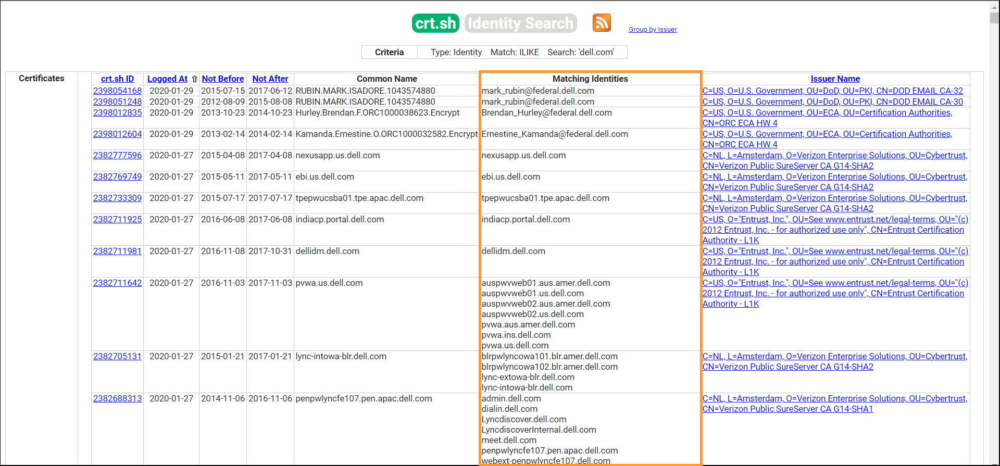

    Tools:

    1. [CTFR](https://github.com/UnaPibaGeek/ctfr)

        - This is a simple tool that grabs all the domains from **crt.sh**.

        ```bash
        git clone https://github.com/UnaPibaGeek/ctfr.git
        
        cd ctfr/
        
        pip3 install -r requirements.txt
        ```

        ```bash
        python3 ctfr.py -d target.com -o output.txt
        ```

    2. One-liners:

        - These are bash onliners to enumerate subdomain through certificates.

        ```bash
        curl "https://tls.bufferover.run/dns?q=.dell.com" | jq -r .Results[] | cut -d ',' -f4 | grep -F ".dell.com" | anew -q output.txt
        ```

        ```bash
        curl "https://dns.bufferover.run/dns?q=.dell.com" | jq -r '.FDNS_A'[],'.RDNS'[]  | cut -d ',' -f2 | grep -F ".dell.com" | anew -q output.txt
        ```

    

- Recursive Enumeration

    - running the subdomain enumeration tools again on each of the subdomains found yields in getting more subdomains in total

    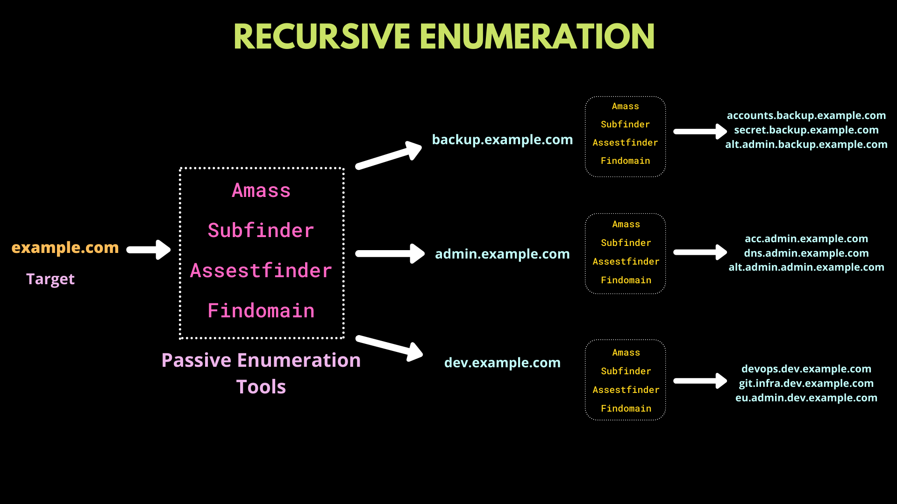

    - The Point to note here is that if you are using some paid API keys from passive sources this single script and eat-up all your quota. So just be aware of what are you performing.

    ```bash
    for sub in $( ( cat subdomains.txt | rev | cut -d '.' -f 3,2,1 | rev | sort | uniq -c | sort -nr | grep -v '1 ' | head -n 10 && cat subdomains.txt | rev | cut -d '.' -f 4,3,2,1 | rev | sort | uniq -c | sort -nr | grep -v '1 ' | head -n 10 ) | sed -e 's/^[[:space:]]*//' | cut -d ' ' -f 2);do 
        subfinder -d example.com -silent | anew -q passive_recursive.txt
        assetfinder --subs-only example.com | anew -q passive_recursive.txt
       
    done
    ```

    


2.**Active Techniques**

- DNS bruteforcing  >>> use vps <<< 

    It's a technique where the person takes a long list of common subdomain names and append their target to them and based on the response determines whether they are valid or not. This is similar to the dictionary attack.

    For that, we need to do a mass DNS resolution. After this process, if any of these subdomains is found valid, it's a win-win situation for us.

    ###### Problems faced during subdomain bruteforcing

    1. Wildcard DNS records
        A wildcard DNS record is a record that matches requests for non-existent domain names. Wildcards are denoted by specifying a **`*`** of the left part of a domain name such as ***.target.com.** That means even if a subdomain doesn't exist it will return a valid response. See the example below:-**doesntexists.target.com**    ---->   **valid** 
        To avoid this various wildcard filtering techniques are used by subdomain bruteforcing tools.

    2. Open Public resolvers

        While bruteforcing we tend to use a long wordlist of common subdomain names to get those hidden domains, hence the domains to be resolved will also be large. Such large resolutions cannot be performed by your system's DNS resolver, hence we depend on freely available public resolvers. Also, using public resolvers eliminates the changes of DNS rate limits.

        We can get the list of open public DNS resolvers from here https://public-dns.info/nameservers.txt

    3. Bandwidth

        While performing subdomain bruteforcing [massdns](https://github.com/blechschmidt/massdns) is used as a base tool for DNS querying at very high concurrent rates. For this, the underlying system should also possess a higher bandwidth.

    ##### [Puredns](https://github.com/d3mondev/puredns)

    Puredns outperforms the work of DNS bruteforcing & resolving millions of domains at once.

    ```bash
    GO111MODULE=on go get github.com/d3mondev/puredns/v2
    ```

    <--- Running --->
    Before we start using puredns for bruteforcing we need to generate our public DNS resolvers. For this, we will use a tool called [dnsvalidator](https://github.com/vortexau/dnsvalidator)

    ```bash
    git clone https://github.com/vortexau/dnsvalidator.git
    
    cd dnsvalidator/
    
    python3 setup.py install
    ```

     It's very important to note that even if one of your public resolver is failing/not working you have a greater chance of missing an important subdomain. Hence, it's always advised that you generate a fresh public DNS resolvers list before execution.

    ```bash
    dnsvalidator -tL https://public-dns.info/nameservers.txt -threads 100 -o resolvers.txt
    ```

    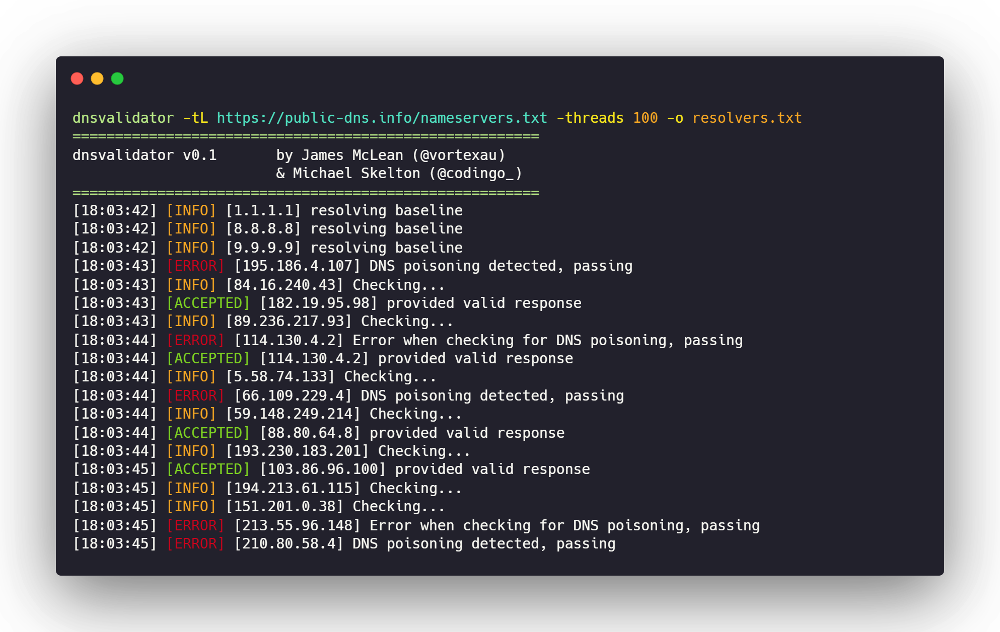

    perform subdomain bruteforcing using puredns.

    ```bash
    puredns bruteforce wordlist.txt example.com -r resolvers.txt -w output.txt
    ```

    **Flags:**

    - *bruteforce** - use the bruteforcing mode

    - **r** - Specify your public resolvers
    - **w** - Output filename

    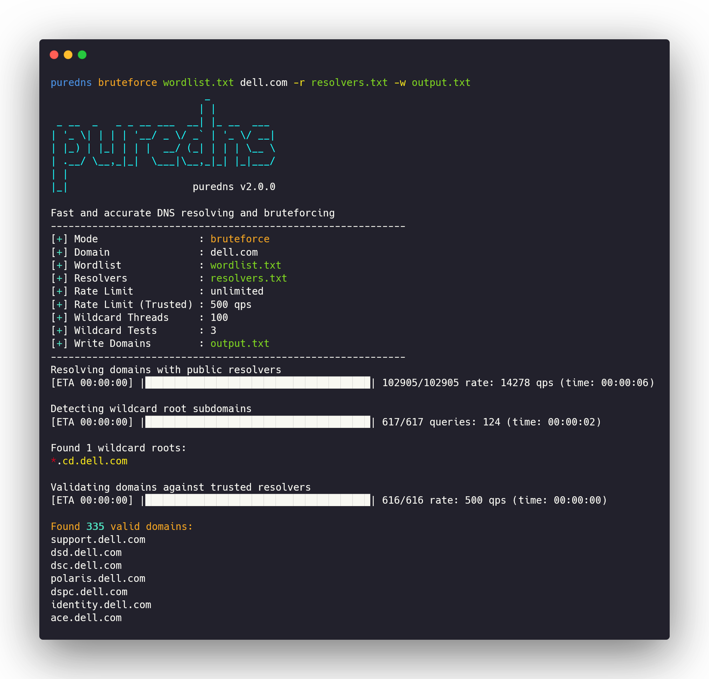

    

    While performing DNS queries sometimes we receive **SERVFAIL** error. Puredns by default retries on SERVFAIL while most tools don't.

    ##### Which wordlist 📄 to use?

    The whole idea DNS bruteforcing is of no use if you don't use a great wordlist. Selection of the wordlist is the most important aspect of bruteforcing. Let's look at what best wordlist:- 
    **1) Assetnote** [**best-dns-wordlist.txt**](https://wordlists-cdn.assetnote.io/data/manual/best-dns-wordlist.txt) (**9 Million**)  [Assetnote](https://wordlists.assetnote.io) 
    the best subdomain bruteforcing wordlist. But highly recommended that you run this in your VPS. 

    **2) Jhaddix** [**all.txt**](https://gist.github.com/jhaddix/f64c97d0863a78454e44c2f7119c2a6a) (**2 Million**) Created by the great [Jhaddix](https://twitter.com/Jhaddix). 

    **3) Smaller** [**wordlist**](https://gist.github.com/six2dez/a307a04a222fab5a57466c51e1569acf/raw) (**102k** )  suitable to be run on home systems.

    

    ##### Issues faced and how to overcome them: 👊 

    1) Crashes on low specs( 1cpu/1gb vps)

    Usually, if you provide a very large wordlist(50M) and your target contains significant wildcards then sometimes puredns crashes out due to less memory while filtering wildcards. To overcome this issue you can use **`--wildcard-batch 1000000`** flag. By default, puredns puts all the domains in a single batch to save on the number of DNS queries and execution time. Using this flag takes in a batch of only 1million subdomains at a time for wildcard filtering and after completion of the task takes in the next batch for wildcard filtering.

    **2) Puredns kills my home router** 

    Massdns is the one to be blamed for. Massdns tries to perform DNS resolution using public resolvers at an unlimited rate. This generates large traffic and makes your home router unable to use for that specific period of time. To overcome this you can use the **`-l`** flag. This flag throttles the massdns threads to your specified amount. It's advisable that you set the value anywhere between `2000-10000`

     

- Permutations

    similar to the previous DNS wordlist bruteforcing but instead of simply performing a dictionary attack we generate combinations /permutations of the already known subdomains.

    we also need a small wordlist with us in this method, which would contain common words like `mail` , `internal`, `dev`, `demo`, `accounts`, `ftp`, `admin`(similar to DNS bruteforcing but smaller)

    For instance, let's consider a subdomain **`dev.example.com`** . Now we will generate different variations/permutations of this domain.

    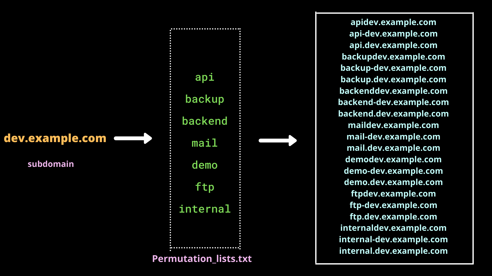

    Now that we have generated these combinations, we further need to DNS resolve them and check if we get any valid subdomains. If so it would be a WIN ! WIN ! situation.

    ##### [Gotator](https://github.com/Josue87/gotator)

    Gotator is DNS wordlist generator tool. It is used to generate various combinations or permutations of a root domain with the user-supplied wordlist. Capable of generating 1M combinations in almost 2 secs. 

    - Permute numbers up and down (**dev2** --> `dev0`, `dev1`, `dev2`, `dev3`,`dev4`)
    - 3 levels of depth (**`dev`****.`demo`.`admin`.**example.com)
    - Controls generation of duplicate permutations
    - Option to add external permutation list
    - Option to permute amongst the subdomains

    ```bash
    go install -v https://github.com/Josue87/gotator@latest
    ```

    <--- Running --->

    - First, we need to make a combined list of all the subdomains(valid/invalid) we collected from all the above steps whose permutations we will create.
    - To generate combinations you need to provide a small wordlist that contains common domain names like admin, demo, backup, api, ftp, email, etc.
    - [This](https://gist.githubusercontent.com/six2dez/ffc2b14d283e8f8eff6ac83e20a3c4b4/raw) is a good wordlist of 1K permutation words that we will need.
    - The below command generates a huge list of non-resolved subdomains.

    ```bash
    gotator -sub subdomains.txt -perm permutations_list.txt -depth 1 -numbers 10 -mindup -adv -md > gotator1.txt
    ```

    ### Flags:

    - **sub** - Specify subdomain list
    - **perm** - Specify permutation/append list
    - **depth** - Configure the depth
    - **numbers** - Configure the number of iterations to the numbers found in the permutations (up and down)
    - **mindup** - Set this flag to minimize duplicates. (For heavy workloads, it is recommended to activate this flag).
    - **md** - Extract 'previous' domains and subdomains from subdomains found in the list 'sub'.
    - **adv** - Advanced option. Generate permutations words with subdomains and words with -. And joins permutation word in the back

    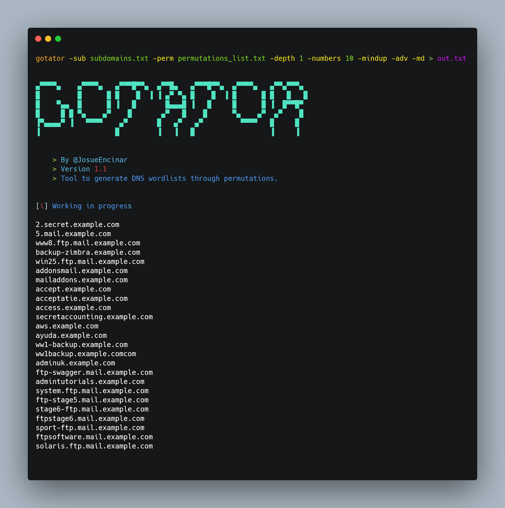

    - Now that we have made a huge list of all the possible subdomains that could exist, now it's time to DNS resolve them and check for valid ones.
    - For this, we will again use [Puredns](https://github.com/d3mondev/puredns).
    - It's always better to generate fresh public DNS resolvers every time we use them.

    ```bash
    puredns resolve permutations.txt -r resolvers.txt
    ```

    

    

- JS/Source Code Scraping

    Each website includes JS files and are a great resource for finding those internal subdomains used by the organization.

    1. [Gospider](https://github.com/jaeles-project/gospider)

        ```bash
        go get -u github.com/jaeles-project/gospider
        ```

        This is a long process so Brace yourself

        <--- Running --->

        (1) Web probing subdomains

        - Since we are crawling a website, gospider excepts us to provide URL's, which means in the form of `http://` `https://`
        - So first, we need to web probe all the subdomains we have gathered till now. For this purpose, we will use [**httpx**](https://github.com/projectdiscovery/httpx) 

        ```bash
        cat subdomains.txt | httpx -random-agent -retries 2 -no-color -o probed_tmp_scrap.txt
        ```

        - send them for crawling to gospider.

        ```]bash
        gospider -S probed_tmp_scrap.txt --js -t 50 -d 3 --sitemap --robots -w -r > gospider.txt
        ```

        > **Caution**: This generates huge traffic on the target

        Flags:

        - **S** - Input file
        - **js** - Find links in JavaScript files
        - **t** - Number of threads (Run sites in parallel) (default 1)
        - **d** - depth (3 depth means scrap links from second-level JS files)
        - **sitemap** - Try to crawl sitemap.xml
        - **robots** - Try to crawl robots.txt

        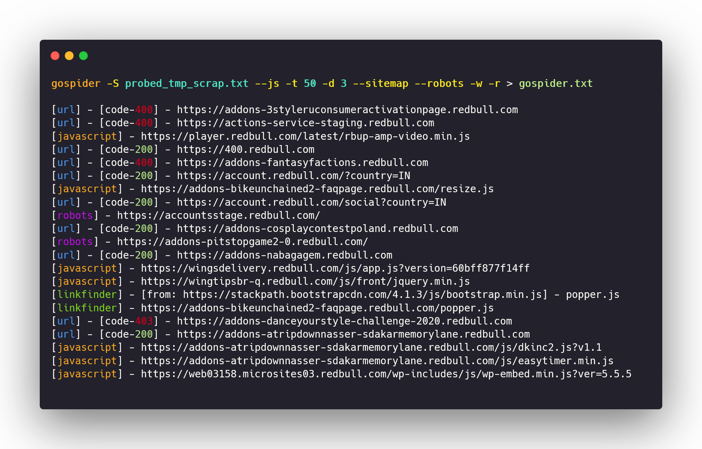

        (2) Cleaning the outputVHOST discovery

        The parth portion of an URL shouldn't have more than 2048 characters. Since, we gopsider

        ```bash
        sed -i '/^.\{2048\}./d' gospider.txt
        ```

        The Point to note here is we have got URLs from JS files & source code till now. We are only concerned with subdomains. Hence we must just extract subdomains from the Gospider output.

        This can be done using Tomnomnom's [**unfurl**](https://github.com/tomnomnom/unfurl) tool. It takes a list of URLs as input and extracts the subdomain/domain part from them. You can install **Unfurl** using this command `go get -u github.com/tomnomnom/unfurl`

        ```bash
        cat gospider.txt | grep -Eo 'https?://[^ ]+' | sed 's/]$//' | unfurl -u domains | grep ".example.com$" | sort -u scrap_subs.txt
        ```

        (3) Resolving our target subdomains

        Now that we have all the subdomains of our target, it's time to DNS resolve and check for valid subdomains.

        ```bash
        puredns resolve scrap_subs.txt -w scrap_subs_resolved.txt -r resolvers.txt 
        ```

        this technique also finds hidden Amazon S3 buckets used by the organization.If such buckets are open and expose sensitive data than its a WIN WIN situation for us. Also the ouput of this can be sent to **secretfinder** tool, whihc can find hidden secrets,exposed api tokens etc.

        

- Google Analytics

    ###### [AnalyticsRelationships](https://github.com/Josue87/AnalyticsRelationships)

    - a tool to enumerate subdomains via Google Analytics ID. It does not require any login and has the capability to bypass the [BuiltWidth ](https://builtwith.com)& [HackerTarget ](https://hackertarget.com)captchas.

    Installation:

    ```bash
    git clone https://github.com/Josue87/AnalyticsRelationships.git
    
    cd AnalyticsRelationships/GO
    
    go build -ldflags "-s -w"
    ```

    <--- Running --->

    - The output may contain false positives.
    - Also, you need to further DNS resolve them in order to get the valid ones.

    ```bash
    ./analyticsrelationships --url https://www.bugcrowd.com
    ```

    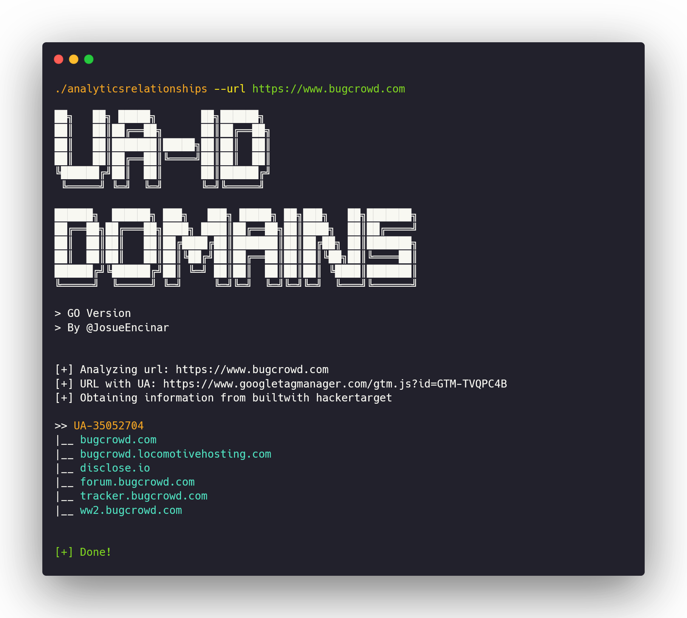

    

    

- TLS, CSP, CNAME probing

    1. TLS Probing

        SSL/TLS(Transport Layer Security) certificate sometimes contains domains/subdomains belonging to the same organization.
        Clicking on the "Lock🔒" button in the address bar, you can view the TLS/SSL certificate of any website.
        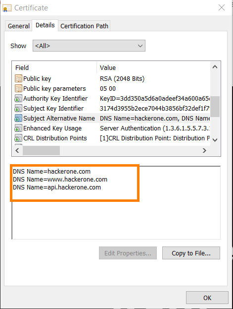

        we will be using a tool called [**Cero**](https://github.com/glebarez/cero)

        ```bash
        go get -u github.com/glebarez/cero
        ```

        <--- Running --->

        ```bash
        cero in.search.yahoo.com | sed 's/^*.//' | grep -e "\." | anew
        ```

        cero in.search.yahoo.com | sed 's/^*.//' | grep -e "\." | anew 

        

        Copied!

        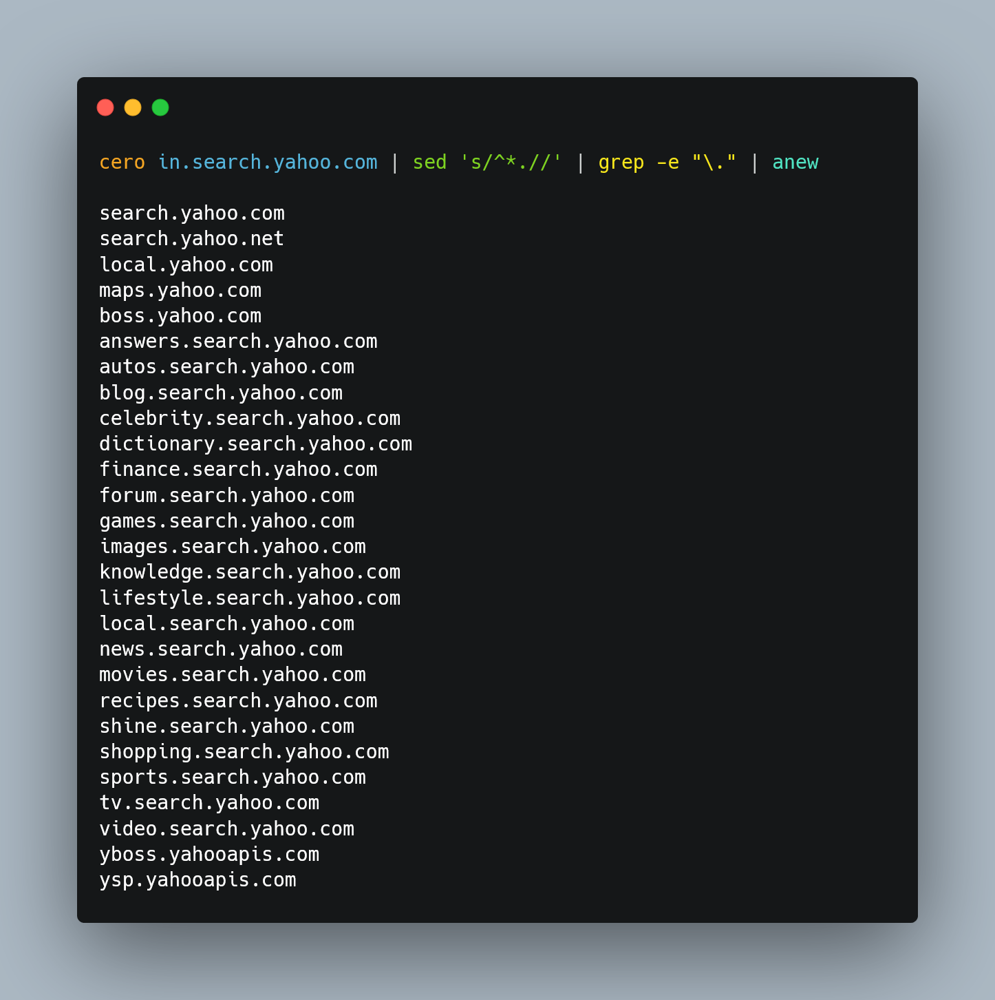

        

    2. CSP Probing

        In order to defend from the XSS attacks as well as keeping in mind to allow cross-domain resource sharing in websites CSP(Content Security Policies) are used. These CSP headers sometimes contain domains/subdomains from where the content is usually imported.

        ```bash
        cat subdomains.txt | httpx -csp-probe -status-code -retries 2 -no-color | anew csp_probed.txt | cut -d ' ' -f1 | unfurl -u domains | anew -q csp_subdomains.txt
        ```

        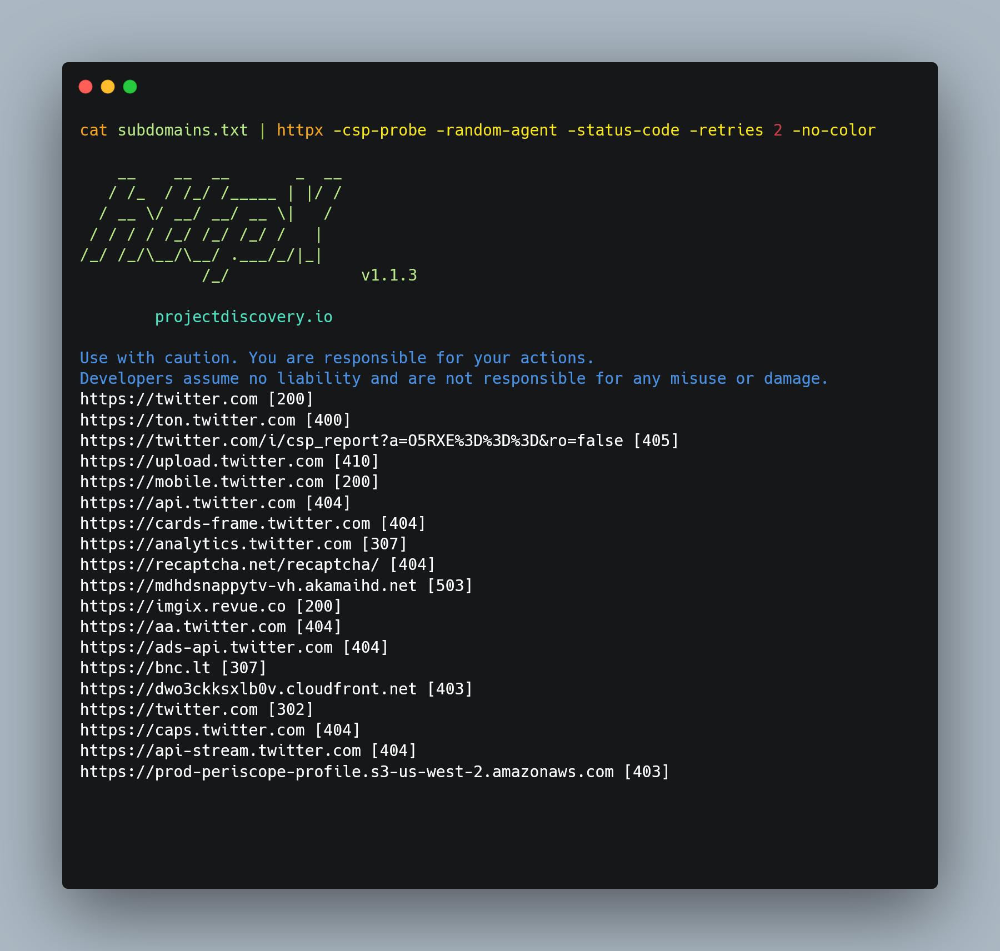

        

    3. CNAME Probing

        > I personally came across 2-3 cases where visiting the CNAME of the website showed me the same website without a firewall. (I personally don't know why this happened)
        > ... said the author

        ```bash
        dnsx -retry 3 -cname -l subdomains.txt
        ```

        

- VHOST probing (Virtual Host)

    There are mainly 2 types of Virtual hosts:

    1. **IP-based Virtual Host:**
        In IP-based Virtual Host, we have different IP addresses for every website.

    2. **Name-based Virtual Host:**
        In named-based Virtual Host, several websites are hosted on the same IP. Mostly this type is widely and preferred in order to preserve IP space.

    But when talking about VHOST we are generally talking about **Named-based Virtual hosts.**

    ###### [HostHunter](https://github.com/SpiderLabs/HostHunter)

    ```bash
    git clone https://github.com/SpiderLabs/HostHunter.git
    
    pip3 install -r requirements.txt
    ```

    <--- Running --->

    ```bash
    python3 hosthunter.py ip_addresses.txt
    ```

    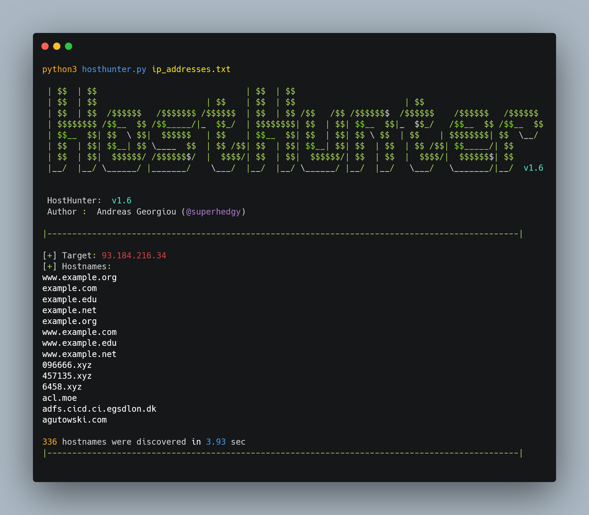


    VHOST bruteforcing:
    
    ```bash
    gobuster vhost -u https://example.com -t 50 -w subdomains.txt
    ```


3.**Web probing**

Another important aspect of subdomain enumeration is identifying web applications hosted on those subdomains. Most people perform pentesting on web applications only hence their accurate identification/discovery is essential.

Port **80 & 443** are the default ports on which web applications are hosted. But one must also check for web applications on other common web ports. Most times something hosted on other common ports is very juicy or paid less attention by organizations.

###### [HTTPX](https://github.com/projectdiscovery/httpx)

- a fast multi-purpose toolkit that allows running multiple HTTP probers and find for web applications on a particular port.
- it provides a ton of flags. So, users can get a highly customizable output as per their needs.

```bash
GO111MODULE=on go get -v github.com/projectdiscovery/httpx/cmd/httpx
```

<--- Running --->

```bash
cat hosts.txt | httpx -follow-redirects -status-code -random-agent -o output.txt
```

## Flags:

- **follow-redirects -** Follows redirects (can go out-of-scope)
- **follow-host-redirects -** Follows redirects if on the same host (helps to be in-scope)
- **random-agent -** Uses a random user-agent for each request
- **status-code -** Shows the status code
- **retries** - Number of times to retry if response not received
- **no-color** - Don't use colorized output (to avoid color Unicode issues in output file)
- **o** - Output file

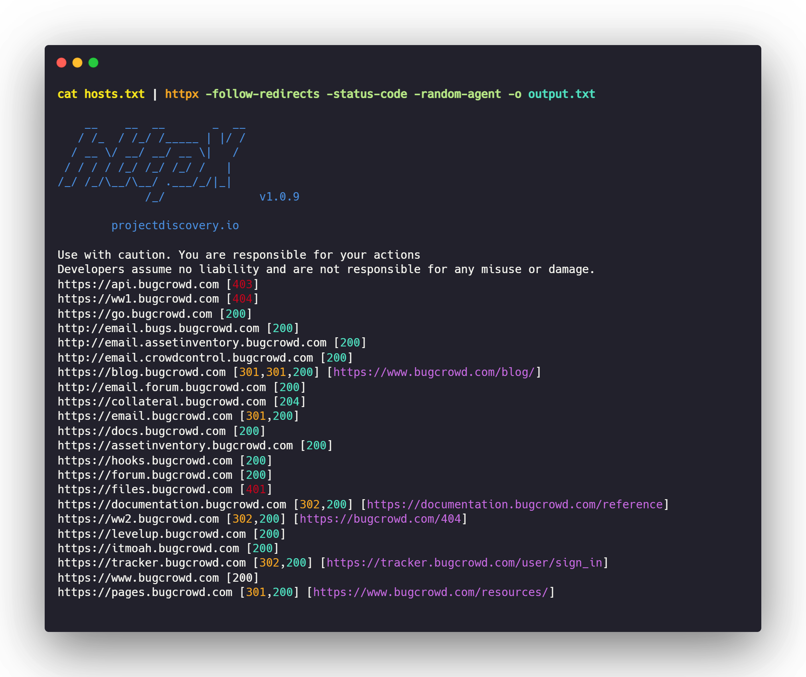

> Probing on default ports:

By default, [**httpx** ](https://github.com/projectdiscovery/httpx)will probes on port **80**(HTTP) & **443**(HTTPS). Organizations host their web applications on these ports. After subdomain enumeration, the next first task is identifying web applications where vulnerabilities are found in abundance.

```bash
cat subdomains.txt | httpx -random-agent -retries 2 -no-color -o output.txt
```

> Probing on common ports:  (check 2nd method)

Generally, there are around **88 common ports** on which web applications may be hosted. So, it's our duty to check for them.  [**Here**](https://gist.github.com/sidxparab/459fa5e733b5fd3dd6c3aac05008c21c) is the list of those common ports. Mostly anything hosted on these ports is very juicy and tends to yield a higher vulnerability.
---> so long method <---

```bash
cat subdomains.txt | httpx -random-agent -retries 2 -threads 150 -no-color -ports 81,300,591,593,832,981,1010,1311,1099,2082,2095,2096,2480,3000,3128,3333,4243,4567,4711,4712,4993,5000,5104,5108,5280,5281,5601,5800,6543,7000,7001,7396,7474,8000,8001,8008,8014,8042,8060,8069,8080,8081,8083,8088,8090,8091,8095,8118,8123,8172,8181,8222,8243,8280,8281,8333,8337,8443,8500,8834,8880,8888,8983,9000,9001,9043,9060,9080,9090,9091,9200,9443,9502,9800,9981,10000,10250,11371,12443,15672,16080,17778,18091,18092,20720,32000,55440,55672 -o output.txt         
```

--> Using **httpx** for common ports generally takes a lot of time as it needs to probe on a relatively higher amount of ports(88 in total). Hence, this method is feasible. <--

**Unimap** is a port scanner that uses [**Nmap**](https://github.com/nmap/nmap) as its base. Using Unimap we quickly scan for whether any of those 88 common ports are open on the subdomain or not(this happens at a blazing fast speed). Once we know that a particular port is open on the subdomain we can later send HTTP probes using **httpx** and check whether a web application is available on that open port or not. This method is far more quicker than just using httpx.

- Sometimes many subdomains point to the same IP address. Hence, scanning the same IP again & again would lead us to an IP ban or greater execution time.

- Unimap uses its own technology to initially resolve the IP addresses of all subdomains, once this process is finished, it creates a vector with the unique IP addresses and launches a parallel scan with Nmap.

```bash
wget -N -c https://github.com/Edu4rdSHL/unimap/releases/download/0.5.1/unimap-linux

sudo mv unimap-linux /usr/local/bin/unimap

chmod 755 /usr/local/bin/unimap

strip -s /usr/local/bin/unimap
```

###### Steps:

**1)** First let's initialize all the common ports into a variable called `COMMON_PORTS_WEB`

```bash
COMMON_PORTS_WEB="81,300,591,593,832,981,1010,1311,1099,2082,2095,2096,2480,3000,3128,3333,4243,4567,4711,4712,4993,5000,5104,5108,5280,5281,5601,5800,6543,7000,7001,7396,7474,8000,8001,8008,8014,8042,8060,8069,8080,8081,8083,8088,8090,8091,8095,8118,8123,8172,8181,8222,8243,8280,8281,8333,8337,8443,8500,8834,8880,8888,8983,9000,9001,9043,9060,9080,9090,9091,9200,9443,9502,9800,9981,10000,10250,11371,12443,15672,16080,17778,18091,18092,20720,32000,55440,55672"
```

**2)** Now we will run a port scan to check all the open ports

```bash
sudo unimap --fast-scan -f subdomains.txt --ports $COMMON_PORTS_WEB -q -k --url-output > unimap_commonweb.txt
```

**3)** Now that we have a list of open ports, we will check for web applications running on them using **httpx**.

````bash
cat unimap_commonweb.txt | httpx -random-agent -status-code -silent -retries 2 -no-color | cut -d ' ' -f1 | tee probed_common_ports.txt
````

- That's it, we have got those hidden web applications running on common ports. Go ahead! and hunt on them. 🐞

and also here are some online tools that can help [dnsdumpster](https://dnsdumpster.com/), [nmmapper](https://www.nmmapper.com/sys/tools/subdomainfinder/), [Spyse](https://spyse.com/), [Url Fuzzer](https://pentest-tools.com/website-vulnerability-scanning/discover-hidden-directories-and-files)
